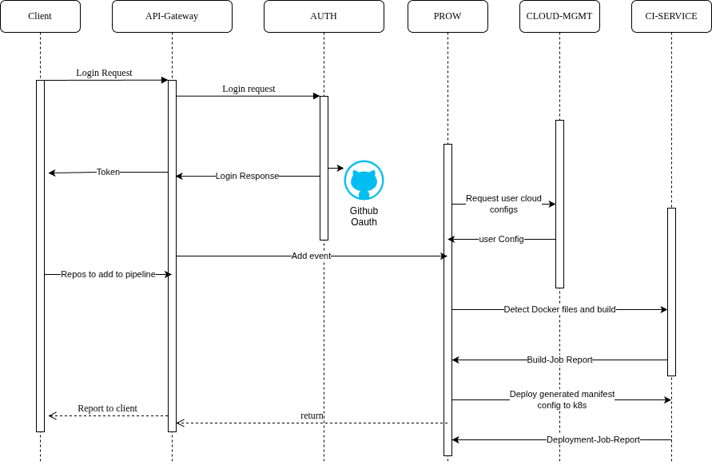

# Persys Cloud

### introduction


Persys Cloud is an open source platform that makes it easy to build and deploy cloud native applications. Whether you're a seasoned developer or just getting started with coding, Persys Cloud provides a user-friendly interface and powerful automation capabilities to help you get up and running quickly. In this document, we'll cover the features and benefits of Persys Cloud, as well as its use cases.


> **Note**: This project is under active development and may have problems and shortcomings.
> 
<!-- TOC -->
* [Persys Cloud](#persys-cloud)
    * [introduction](#introduction)
    * [Overview](#overview)
      * [Features and Capabilities](#features-and-capabilities)
      * [Benefits](#benefits)
      * [Some Of Our Services](#some-of-our-services)
      * [Use Cases](#use-cases)
  * [Architecture](#architecture)
  * [Local Development](#local-development)
    * [Docker-Compose:](#docker-compose)
    * [Kind:](#kind)
    * [ShellScript:](#shellscript)
  * [Getting started!](#getting-started)
  * [Contributions](#contributions)
  * [Open Source Tech We Use](#open-source-tech-we-use)
  * [Project Road Map](#project-road-map)
  * [Services Description](#services-description)
  * [Documentation](#documentation)
  * [Community:](#community)
  * [Conclusion:](#conclusion)
  * [Cloud Native Computing Foundation](#cloud-native-computing-foundation)
<!-- TOC -->

### Overview
#### Features and Capabilities
- User-friendly interface for managing applications and infrastructure.
- Powerful automation capabilities for scaling applications up or down as needed.
- Highly scalable and flexible, designed to work with a wide range of cloud providers.
- Open source and community-driven development, allowing users to contribute new features and improvements.
- Customizable to meet the unique needs of your organization.
- Supports a wide range of containerized workloads, including microservices, web applications, and more.
- Provides powerful monitoring and management capabilities, including logs, metrics, and health checks for your applications,
- Easy to use, with step-by-step instructions for performing specific tasks and best practices for Kubernetes application deployment and management.
- CI/CD pipeline management capabilities, allowing you to easily set up and manage your entire pipeline.
- Integration with other cloud service providers, making it easy to build and manage complex cloud native applications that span multiple cloud environments and services.
- Fabric Service to create a service mesh and manage multiple clusters across multiple cloud environments.
- GPU-accelerated Kubernetes clusters for AI and MLOps workloads.
- Automates many of the tasks typically performed by SRE engineers
- Provides DevOps/SRE as a service

#### Benefits

- Simplifies the process of building and deploying cloud native applications.
- Provides a powerful, flexible, and easy-to-use platform that can be customized to meet the unique needs of your organization.
- Reduces the workload of SRE engineers by automating many of the tasks typically performed by them.
- Streamlines operations and improves overall efficiency.
- Open source and community-driven development ensures that the platform is constantly evolving and improving.

#### Some Of Our Services
1. Managed Kubernetes as a service across multiple clouds.
2. DevOps/SRE as a Service: Persys Cloud provides DevOps/SRE as a service, including automation capabilities, powerful monitoring and management, and CI/CD pipeline management.
3. Fabric Service: Persys Cloud uses Fabric Service to create a service mesh and manage multiple clusters across multiple cloud environments.
4. GPU-accelerated Kubernetes Clusters: Persys Cloud will soon provide GPU-accelerated Kubernetes clusters for AI and MLOps workloads.
5. Object Storage Integration: Persys Cloud will soon integrate with S3 buckets, Azure files, and other cloud provider object storages as a sidecar to your workloads.
6. MongoDB, Kafka , Postgres, Signoz, Backstage, ETCD, ...etc as a service.


#### Use Cases

- Building and deploying cloud native applications.
- Managing multiple clusters across multiple cloud environments.
- Running complex machine learning and deep learning workloads.
- Automating the job of an SRE engineer.
- Streamlining operations and improving overall efficiency.


## Architecture
* **this is the system design that i came up with, a high level mind map to look at.**
* feel free to open an ISSUE mentioning any problems or ideas you might have!

  

* **an over simplified request flow**

  


## Local Development
* First clone the repository:
```shell
git clone https://github.com/persys-dev/persys-devops
```
### Docker-Compose:
* Then using make file you can do :
```shell
make up
```
**this initializes the project on a local docker environment using docker-compose**
### Kind:
* As an alternative way you can use make which will build and deploy the project to a kind environment:
```shell
make kind
```
**this will build every docker file locally tag it and generate kubernetes deployment files and deploying them.**
### ShellScript:
* if you don't have make just run the following commands to use the initialization script.
````shell
chmod +x /.init.sh
/.init.sh
````
**PLEASE MAKE SURE YOU HAVE : Docker , Kubectl , Kind to run the project in you desired environment.**

## Getting started!
**you can use pure http rest requests/ CLI client to interact with our platform.**
<br>
<br>
**to keep it very simple:**
<br>
* download the CLI client or use Postman to interact with our api.
* login using gitHub oAuth.
* the application will read all of your repositories and list them so you can add them to your pipeline.
* our servers will prepare a kubernetes as a service for you or connect to your cloud provider.
* then we'll read your pipeline details from root of your repo and initialize all your required services for your app.if theres no pipeline manifest we will let you know!
* then add personal access tokens and set webhooks for your repositories.
* you can run a pipeline manually but when the application adds webhook to your repo you simply just need to push your code to github!
* push your code to github!
* monitor the building , tests , security , deployment!
* notify the project owner and/or your team!
  <br>
**that's it now you have a ci/cd pipeline + production environment!**
  <br>
  **refer to [getting-started.md](https://github.com/miladhzzzz/persys-cicd/docs/getting-started.md) for a better understanding of how this software works!**

## Contributions
**we are looking for contributors in fields of expertise listed below:**
<br>
* DevOps Engineers
* Golang developers
* Rust developers
* Cloud network engineers
* Datacenter Architectures and designers
* Software test specialist
* Project managers

**please refer to community section and consider joining us**
[Community](#community)
## Open Source Tech We Use
* [Backstage](https://github.com/backstage/backstage)
* [apache kafka](https://github.com/obsidiandynamics/kafdrop)
* [gRPC](https://github.com/grpc)
* [Git]()
* [Rust (Programming Language)]()
* [Terraform]()
* [Kubernetes](https://github.com/kubernetes/kubernetes)
* [Go (Programming Language)]()
* [OpenTelemtry](https://github.com/opentelemtry)
* [Watermill](https://github.com/watermill)
* [Mongodb](https://github.com/mongodb)
* [Signoz](https://github.com/signoz)
* [Kafdrop](https://github.com/obsidiandynamics/kafdrop)
* [Ceph](https://github.com/ceph)
* [Github](https://github.com)

## Project Road Map
* Q1 2023 : Clean UP the code repository for and rebase to public repository.
* Q1 2023 : Build our Community to help develop, manage , market our product.
* Q1 2023 : Test First Working version!
* Q2 2023 : Submit project to CNCF sandbox projects and integrate our community with the world!
* Q2 2023 : Hopefully we can get our hands on Infrastructure needed to launch our Hosted version of our software.
* Q3 2023 : Grow our Community and hire people to help!
* Q4 2023 : Release the software for on premise use (hosting it yourself).
* Q4 2023 : World Dominance :D.

## Services Description
**Each Service have an README.md in the root of the service refer to those for seeing what each component does and who are the owners.**
## Documentation
**the documentation will be located at https://github.com/miladhzzzz/persys-devops/docs**
* [getting-started.md](https://github.com/miladhzzzz/persys-cicd/docs/getting-started.md)
* [how-it-works.md](https://github.com/miladhzzzz/persys-cicd/docs/how-it-works.md)
* [install.md](https://github.com/miladhzzzz/persys-cicd/install.md)
* [architecture.md](https://github.com/miladhzzzz/persys-cicd/architecture.md)
* [contributions.md](https://github.com/miladhzzzz/persys-cicd/contributions.md)

## Community:
Persys Cloud is an open source and community-driven development platform, which means that users can contribute new features and improvements to the platform directly through GitHub. If you want a specific service or feature in Persys Cloud, you can open up a pull request against our repository, and we will review the PR. Alternatively, if you encounter any issues or have questions about the platform, you can open an issue, and we will respond to each one. By contributing to Persys Cloud, you can help to shape the future of the platform and ensure that it continues to meet the evolving needs of the cloud native community. We welcome all contributions and feedback from our users, and we are committed to providing a high-quality and user-friendly platform for building and deploying cloud native applications.
https://join.slack.com/t/persys-cicd/shared_invite/zt-1lje1wst0-E0TjKMIXGe1FGLex1uQoxg

## Conclusion:

Persys Cloud is a powerful and flexible platform that simplifies the process of building and deploying cloud native applications. Its user-friendly interface, automation capabilities, and highly scalable and flexible design make it a popular choice for organizations of all sizes. With its open source and community-driven development, Persys Cloud is constantly evolving and improving, ensuring that it remains a cutting-edge solution for cloud native development.


## Cloud Native Computing Foundation
<br>
this project is currently in the sandbox waiting list of Cloud Native Computing Foundation, and as we mentioned above we are using and supporting a lot of CNCF technologies
<br>
so, thank you 

[CNCF](https://github.com/miladhzzzz/persys-cicd) <3

