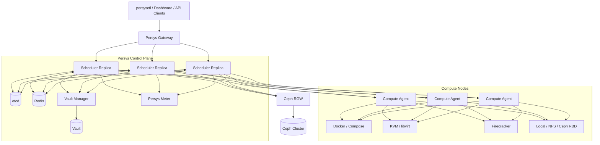

# Persys Cloud

[](LICENSE)
[](https://go.dev)
[](https://grpc.io)
[](https://docker.com)
[](https://nextjs.org)

**Persys Cloud is an open-core distributed compute control plane for heterogeneous infrastructure.**

Persys turns a collection of physical machines into a programmable compute platform capable of running **containers, Docker Compose applications, virtual machines, and Firecracker microVMs**, with managed local, NFS, and Ceph RBD storage.

It is built around a scheduler-driven architecture, explicit desired state, continuous reconciliation, explainable placement, and infrastructure that can continue operating through individual node and service failures.

Persys is designed for **private clouds, regional infrastructure providers, edge environments, sovereign infrastructure, and operators who need cloud-like primitives without depending entirely on a hyperscaler.**

---

# The idea

Modern infrastructure is increasingly fragmented.

Containers have one set of tools.

Virtual machines have another.

Storage has another.

Networking has another.

Deployment systems often maintain their own state.

And when something fails, operators frequently end up debugging several independent control systems at once.

Persys takes a different approach:

> **One control plane should understand the desired state of the infrastructure, decide where workloads belong, and continuously drive the physical infrastructure toward that state.**

The underlying machines remain heterogeneous.

A node might provide:

* Docker
* Docker Compose
* KVM/libvirt
* Firecracker
* local storage
* NFS
* Ceph RBD

Persys exposes these as capabilities to the scheduler rather than forcing every node to look identical.

---

# What Persys provides

### Compute

* Docker containers
* Docker Compose applications
* KVM virtual machines
* Firecracker microVMs
* Cloud-init based VM provisioning
* Runtime capability detection
* Workload lifecycle management

### Scheduling

* Resource-aware placement
* CPU and memory accounting
* Storage capability-aware placement
* Workload-type capability filtering
* Node labels and taints
* Node draining
* Placement exclusion
* Workload relocation
* In-flight resource reservations
* Spread-aware scheduling
* Deterministic tie-breaking

### Storage

Managed block storage with:

* Local directories
* NFS
* Ceph RBD

Volumes can be:

* provisioned
* attached
* mounted
* detached
* retained
* deleted

Local storage attachments can impose node affinity where required.

### Object storage

Persys integrates with **Ceph RGW** for S3-compatible object storage.

Buckets and objects remain authoritative in RGW rather than being copied into the control-plane database.

Bucket credentials are managed through Vault.

### Reliability

* Scheduler failover
* Active-active scheduler sharding
* etcd-backed durable state
* Redis-backed high-churn telemetry and events
* Desired-state reconciliation
* Drift detection
* Retry backoff
* Failure grace periods
* Node liveness detection
* Degraded and recovery operating modes
* Idempotent control-plane operations

### Security

* Mutual TLS between control-plane components
* Vault-backed certificate lifecycle
* vault-manager for service identity
* AppRole-based service authentication
* Secret storage in Vault
* Authenticated node-to-scheduler communication

### Observability

* Prometheus metrics
* OpenTelemetry tracing
* Per-workload utilization
* CPU utilization
* Memory usage
* Disk I/O
* Network throughput
* Cluster events
* Reconciliation telemetry
* Health and readiness endpoints
* Historical telemetry through Persys Meter

---

# Architecture

Persys is deliberately divided into a **control plane** and a **data plane**.


```mermaid
flowchart TB

    USER[persysctl / Dashboard / API Clients]

    GW[Persys Gateway]

    subgraph CONTROL["Persys Control Plane"]

        SCH1[Scheduler Replica]
        SCH2[Scheduler Replica]
        SCH3[Scheduler Replica]

        ETCD[(etcd)]
        REDIS[(Redis)]

        VM[Vault Manager]
        VAULT[(Vault)]

        METER[Persys Meter]
    end

    subgraph DATA["Compute Nodes"]

        A1[Compute Agent]
        A2[Compute Agent]
        A3[Compute Agent]

        D1[Docker / Compose]
        V1[KVM / libvirt]
        F1[Firecracker]

        S1[Local / NFS / Ceph RBD]
    end

    RGW[Ceph RGW]
    CEPH[(Ceph Cluster)]

    USER --> GW

    GW --> SCH1
    GW --> SCH2
    GW --> SCH3

    SCH1 <--> ETCD
    SCH2 <--> ETCD
    SCH3 <--> ETCD

    SCH1 <--> REDIS
    SCH2 <--> REDIS
    SCH3 <--> REDIS

    SCH1 --> A1
    SCH1 --> A2
    SCH2 --> A2
    SCH2 --> A3
    SCH3 --> A1
    SCH3 --> A3

    A1 --> D1
    A1 --> V1
    A1 --> F1
    A1 --> S1

    A2 --> D1
    A2 --> V1
    A2 --> F1
    A2 --> S1

    A3 --> D1
    A3 --> V1
    A3 --> F1
    A3 --> S1

    SCH1 --> RGW
    SCH2 --> RGW
    SCH3 --> RGW

    RGW --> CEPH

    SCH1 --> VM
    SCH2 --> VM
    SCH3 --> VM

    VM --> VAULT

    SCH1 --> METER
    SCH2 --> METER
    SCH3 --> METER
```

The important architectural boundary is:

> **The scheduler decides. The agent executes.**

The compute agent does not independently schedule workloads.

It receives desired state from the scheduler, applies that state to the local runtime, reports actual state and telemetry, and continuously reconciles local state.

---

# Scheduler

The scheduler is the authoritative control-plane component responsible for cluster-wide placement and convergence.

It maintains durable cluster state in etcd, including:

* nodes
* workload specifications
* workload status
* assignments
* volumes
* volume attachments
* retry state
* reconciliation records
* drift information

High-frequency operational data is deliberately kept out of etcd.

Redis is used for:

* reconciliation metadata
* cluster events
* high-churn telemetry
* bounded event history

This separation prevents operational churn from competing with the control plane's durable state.

---

# High availability

Persys supports multiple scheduler replicas.

Two operating modes are currently supported.

## Failover mode

In `failover` mode, scheduler replicas participate in an etcd-backed lease election.

Only one replica actively drives:

* reconciliation
* node monitoring
* workload monitoring
* drift detection
* placement convergence

The remaining replicas are hot standbys.

If the active scheduler fails or its lease expires, another replica takes over.

This provides a straightforward active/standby control-plane topology.

```text
                 ┌───────────────┐
                 │ Load Balancer │
                 └───────┬───────┘
                         │
              ┌──────────┴──────────┐
              │                     │
        ┌─────▼─────┐         ┌─────▼─────┐
        │ Scheduler │         │ Scheduler │
        │  ACTIVE   │         │ STANDBY   │
        └─────┬─────┘         └─────┬─────┘
              │                     │
              └──────────┬──────────┘
                         │
                       etcd
```

The scheduler's external gRPC API remains available on every replica.

Writes use etcd compare-and-swap semantics so requests can safely be routed to any scheduler replica.

---

## Active-active sharding

For larger clusters, Persys supports scheduler sharding.

Nodes are deterministically assigned to scheduler shards using a stable hash of their node identity.

Each scheduler replica drives reconciliation for its assigned shard.

```text
                    ┌───────────────┐
                    │ Load Balancer │
                    └───────┬───────┘
                            │
              ┌─────────────┼─────────────┐
              │             │             │
        ┌─────▼─────┐ ┌─────▼─────┐ ┌─────▼─────┐
        │ Scheduler │ │ Scheduler │ │ Scheduler │
        │  Shard 0  │ │  Shard 1  │ │  Shard 2  │
        └─────┬─────┘ └─────┬─────┘ └─────┬─────┘
              │             │             │
              └─────────────┼─────────────┘
                            │
                          etcd
```

Each shard can itself have multiple replicas for failover.

This allows the control plane to scale its reconciliation work horizontally instead of requiring one scheduler process to drive the entire cluster.

---

# Reconciliation

Persys treats infrastructure as desired state.

A simplified lifecycle looks like:

```text
             Desired State
                   │
                   ▼
             ┌───────────┐
             │ Scheduler │
             └─────┬─────┘
                   │
             placement
                   │
                   ▼
             ┌───────────┐
             │   Agent   │
             └─────┬─────┘
                   │
                   ▼
             Local Runtime
                   │
                   ▼
             Actual State
                   │
                   └──────────────┐
                                  │
                         report + heartbeat
                                  │
                                  ▼
                             Scheduler
```

The scheduler continuously compares desired state with reported actual state.

When they diverge, Persys attempts to converge the system again.

This applies to:

* workload lifecycle
* workload placement
* runtime state
* storage attachments
* workload revisions
* node availability

---

# Drift detection

Persys explicitly detects divergence between control-plane state and runtime state.

Examples include:

* workload exists on an agent but not in scheduler state
* scheduler expects a workload to be running but the agent reports it stopped
* workload revision differs
* scheduler expects a workload that is missing from the agent

Detected drift generates cluster events and can trigger automated remediation when safe.

Reapplication is protected by exponential backoff so a broken workload does not create an infinite apply loop.

---

# Scheduling

Persys scheduling is capability-aware rather than simply CPU-based.

Before selecting a node, the scheduler filters candidates according to:

* node readiness
* node taints
* workload type
* CPU availability
* memory availability
* storage requirements
* supported storage drivers
* node labels
* placement constraints

The remaining candidates are scored using:

* CPU headroom
* memory headroom
* workload distribution
* existing commitments
* deterministic tie-breaking

The scheduler also maintains **in-flight reservations**.

This prevents several simultaneous placement operations from observing the same stale heartbeat and selecting the same apparently underutilized node.

---

# Runtime model

The compute agent provides a common runtime abstraction.

```text
                 Compute Agent
                       │
                 Runtime Layer
          ┌────────────┼────────────┐
          │            │            │
       Docker       libvirt     Firecracker
          │            │            │
     Containers       VMs       MicroVMs
```

This allows Persys to reason about workload requirements without coupling the scheduler directly to a specific runtime.

A single infrastructure cluster can therefore contain heterogeneous nodes.

For example:

```text
Node A
├── Docker
├── KVM
└── Ceph RBD

Node B
├── Docker
└── Firecracker

Node C
├── KVM
├── Docker
├── NFS
└── Ceph RBD
```

The scheduler places workloads according to the capabilities advertised by each node.

---

# Firecracker microVMs

Persys supports **Firecracker microVMs as a first-class workload runtime**.

This provides a workload isolation model between traditional containers and full virtual machines.

The runtime matrix therefore includes:

| Runtime     | Isolation       | Typical use                      |
| ----------- | --------------- | -------------------------------- |
| Docker      | Container       | Applications / services          |
| Compose     | Container stack | Multi-service applications       |
| KVM         | VM              | General-purpose virtual machines |
| Firecracker | MicroVM         | Lightweight isolated workloads   |

This is particularly useful for infrastructure where startup time, density, and stronger isolation are important.

---

# Managed storage

Persys separates storage provisioning from workload execution.

Supported block-storage drivers currently include:

| Driver     | Description                         |
| ---------- | ----------------------------------- |
| `local`    | Node-local directory-backed storage |
| `nfs`      | NFS-backed storage                  |
| `ceph-rbd` | Ceph RBD block devices              |

The scheduler considers storage capabilities during placement.

For example, a workload requesting Ceph RBD storage cannot be assigned to a node that does not advertise Ceph RBD capability.

The volume lifecycle is:

```text
Provision
    │
    ▼
Attach
    │
    ▼
Mount
    │
    ▼
Workload Running
    │
    ▼
Detach
    │
    ▼
Delete / Retain
```

Volumes can use explicit retention policies so that infrastructure operators can preserve data after workload deletion.

---

# Ceph

Persys uses Ceph for distributed storage where available.

Two separate Ceph interfaces are treated differently.

### RBD

Ceph RBD provides block storage to workloads.

The compute agent handles the node-local mapping and attachment of RBD volumes.

### RGW

Ceph RGW provides S3-compatible object storage.

Object storage is a **cluster-level service** and does not involve compute agents.

```text
Persys Scheduler
       │
       │ S3 API
       ▼
   Ceph RGW
       │
       ▼
  Ceph Object Pool
```

RGW remains authoritative for:

* buckets
* objects

Vault stores the associated access credentials.

This avoids turning etcd into an object-storage metadata database.

---

# Control-plane state

Persys intentionally uses different systems for different classes of state.

| System                 | Responsibility                         |
| ---------------------- | -------------------------------------- |
| **etcd**               | Durable control-plane state            |
| **Redis**              | High-churn operational data and events |
| **Ceph RBD**           | Distributed block storage              |
| **Ceph RGW**           | S3 object storage                      |
| **Vault**              | Secrets and PKI                        |
| **ClickHouse / Meter** | Historical workload telemetry          |

The principle is simple:

> **Do not put every kind of data into the same database.**

The control plane should contain the state required to make correct decisions.

High-frequency telemetry and observability data should not compete with that state.

---

# Failure handling

Persys is designed around explicit failure modes rather than assuming infrastructure is healthy.

Scheduler operating modes include:

### Normal

etcd is healthy and writable.

Scheduling, reconciliation, and mutations are enabled.

### Degraded

The scheduler cannot safely communicate with etcd.

Mutating operations are frozen.

Agents are instructed to drain rather than accepting new work.

Read-only and health endpoints remain available where possible.

### Recovery

etcd has become reachable again but persistent control-plane state is unexpectedly empty.

The scheduler remains frozen rather than interpreting an empty database as an empty cluster.

This is an intentional safety mechanism.

> **An empty control database should never accidentally mean "delete everything."**

---

# Node failure

Nodes maintain leases and heartbeats with the scheduler.

When a node becomes unavailable, Persys can:

1. detect the loss
2. mark the node unavailable
3. identify workloads assigned to it
4. determine which workloads can be relocated
5. select replacement nodes
6. reapply desired state
7. continue reconciliation

Storage constraints influence whether relocation is possible.

For example, workloads using node-local storage cannot silently migrate to another node unless their storage semantics permit it.

---

# Security

Persys uses mutual TLS for control-plane communication.

The trust architecture is built around Vault and `vault-manager`.

```text
                 Vault
                   │
            ┌──────┴──────┐
            │ vault-manager│
            └──────┬──────┘
                   │
          certificate lifecycle
                   │
        ┌──────────┼──────────┐
        │          │          │
     Gateway   Scheduler    Agent
        │          │          │
        └──────── mTLS ───────┘
```

`vault-manager` provides zero-touch service credential and certificate lifecycle mechanisms so services do not need long-lived credentials manually embedded into deployments.

Vault is also used for:

* PKI
* service identity
* AppRole authentication
* object-storage credentials
* other sensitive control-plane secrets

---

# Observability

Persys exposes operational information at several layers.

### Scheduler

Prometheus metrics include:

* gRPC request rate
* request latency
* reconciliation results
* reconciliation duration
* node status
* workload status
* desired state
* resource utilization
* state-store operations

### Workload telemetry

Persys tracks:

* CPU utilization
* memory usage
* disk I/O
* network RX/TX

Telemetry can be consumed by Persys Meter for historical analysis and live monitoring.

### Distributed tracing

Control-plane operations are instrumented using OpenTelemetry.

---

# Cluster events

Persys exposes human-readable cluster events such as:

* `NodeJoined`
* `NodeLost`
* `NodeLeft`
* `WorkloadScheduled`
* `WorkloadFailed`
* `DriftDetected`
* `RetryTriggered`
* `Rescheduled`
* `Relocated`

Events are stored in Redis Streams rather than etcd.

This is intentional.

Events are observability data, not authoritative cluster state.

Their retention is bounded and their loss should not compromise cluster correctness.

---

# Interfaces

Persys provides several interfaces over the same control plane.

### Dashboard

The web dashboard provides an operator-facing interface for:

* workloads
* nodes
* clusters
* storage
* object storage
* telemetry
* operational state

### REST

The gateway exposes HTTP APIs for external clients and the dashboard.

### gRPC

The internal control plane communicates through gRPC.

The scheduler exposes the `AgentControl` API for node registration, workload lifecycle, status, and cluster operations.

### persysctl

`persysctl` provides CLI access to the platform over supported transports.

---

# Project structure

Persys is maintained as a monorepo containing the platform's control-plane, runtime, and tooling components.

```text
persys-cloud/
├── compute-agent/
├── persys-scheduler/
├── persys-gateway/
├── persys-dashboard/
├── persys-meter/
├── persysctl/
├── persys-intelligence/
├── persys-automation/
├── vault-manager/
├── infra/
└── docs/
```

The architecture is intentionally service-oriented while remaining within a single repository so that platform contracts can evolve together.

---

# Current platform maturity

Persys has moved beyond the initial architectural prototype.

The current platform includes:

* scheduler high availability
* scheduler failover
* active-active scheduler sharding
* distributed durable state through etcd
* workload reconciliation
* drift detection
* resource-aware scheduling
* in-flight scheduling reservations
* node drain and taint handling
* Docker workloads
* Docker Compose workloads
* KVM virtual machines
* Firecracker microVMs
* cloud-init provisioning
* local storage
* NFS storage
* Ceph RBD storage
* Ceph RGW object storage
* Vault-backed PKI
* zero-touch certificate lifecycle
* mTLS control-plane communication
* Prometheus metrics
* OpenTelemetry tracing
* workload telemetry
* Persys Meter
* gateway-based service routing

The remaining work is primarily **hardening, operational validation, network abstraction completion, rollout controls, and production deployment engineering**, rather than defining the fundamental architecture from scratch.

See [Production Readiness](docs/production-readiness.md) for the current delivery roadmap.

---

# Roadmap

The near-term roadmap focuses on making the existing platform increasingly predictable and production-ready.

## Infrastructure

* Complete network abstraction
* Runtime dependency injection
* Advanced VM networking
* Storage pool management
* Stronger workload isolation
* Production HA deployment patterns

## Reliability

* Expanded failure-mode testing
* Scheduler failover drills
* Storage failure testing
* Node failure testing
* Network partition testing
* Recovery and rollback procedures
* Large-cluster benchmarking

## Operations

* Feature gates
* Canonical configuration validation
* Improved health/readiness semantics
* Upgrade and rollback tooling
* Deployment templates
* Better operational documentation

## Platform

* GitOps workflows
* Improved application deployment UX
* Federation
* Multi-cluster management
* Higher-level platform services
* Future PaaS and DBaaS capabilities

---

# Development

## Requirements

* Go
* Docker
* Node.js
* libvirt/KVM for VM testing
* Firecracker for microVM testing
* etcd
* Redis

Ceph and NFS are required for testing their respective storage backends.

---

## Build

```bash
git clone https://github.com/persys-dev/persys-cloud.git
cd persys-cloud
```

Build individual components using their respective Makefiles.

For example:

```bash
cd compute-agent
make build
```

or:

```bash
cd persys-scheduler
go build ./...
```

---

## Testing

Persys separates unit, integration, and end-to-end validation.

Examples:

```bash
cd compute-agent

make test-unit
make test-e2e
```

and:

```bash
cd persys-scheduler

go test ./...
```

The project also contains dedicated infrastructure and chaos/benchmarking work for validating failure modes and control-plane behavior under load.

---

# Design principles

Persys is built around a small number of principles.

### 1. Desired state over imperative orchestration

The system should describe what infrastructure **should be**, then continuously converge toward it.

### 2. Scheduler authority

Placement decisions belong to the control plane.

Agents execute.

### 3. Explicit failure handling

Failures should be represented as states and transitions rather than hidden behind retries that operators cannot understand.

### 4. Explainable decisions

Operators should be able to understand why a workload was placed somewhere, why it was not placed elsewhere, and why the system is attempting recovery.

### 5. Heterogeneous infrastructure

A cloud does not need every machine to be identical.

Capabilities should be advertised and scheduling should respect them.

### 6. Separate control state from operational data

Durable decisions belong in the consensus-backed control store.

High-volume telemetry and events belong elsewhere.

### 7. Fail safely

When the control plane loses the information required to make safe decisions, Persys should stop making destructive assumptions.

### 8. Open infrastructure

Persys is open-core and built around widely available infrastructure primitives rather than requiring a proprietary hardware or virtualization stack.

---

# Why Persys exists

Cloud infrastructure has become incredibly powerful, but the fundamental model remains surprisingly centralized.

A large portion of the world's infrastructure ultimately depends on a relatively small number of hyperscale providers and their control planes.

Persys explores another model:

> **A cloud should be something you can build from infrastructure you control.**

A small cluster can run Persys.

A private datacenter can run Persys.

An edge deployment can run Persys.

A regional infrastructure provider can run Persys.

And the same control-plane concepts can scale from a handful of machines toward substantially larger deployments.

Persys is therefore not an attempt to recreate one hyperscaler feature at a time.

It is an attempt to build a **portable, explainable distributed infrastructure control plane** that can operate wherever the infrastructure exists.

---

# License

Persys Cloud is released under the MIT License.

See [LICENSE](LICENSE).

---

## Links

* [Persys Cloud](https://github.com/persys-dev/persys-cloud)
* [Documentation](docs/)
* [Architecture](docs/architecture/)
* [Production Readiness](docs/production-readiness.md)

---

*Persys Cloud — programmable infrastructure for infrastructure you control.*
