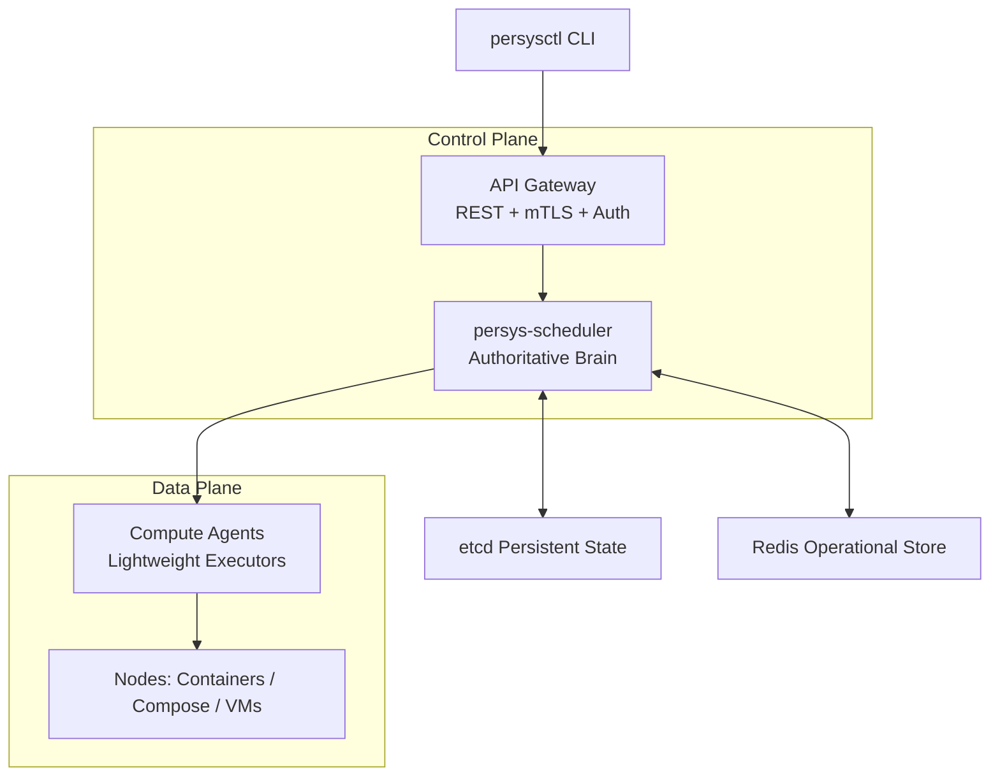

# Persys Compute

[](LICENSE)
[](https://go.dev)
[](https://grpc.io)
[](https://docker.com)

**An explainable, scheduler-driven distributed compute control plane that orchestrates Docker containers, Docker Compose applications, and virtual machines across heterogeneous infrastructure.**

Persys unifies fragmented tooling (containers, Compose, VMs, bare-metal, cloud) into a single programmable, resilient, and explainable platform — inspired by hyperscalers but designed for private/hybrid/edge environments.

## The Problem

Modern infrastructure is fragmented:

- **Containers**: Fast microservices.
- **Docker Compose**: Multi-service stacks with dev parity.
- **Virtual Machines**: Legacy/full-OS workloads.
- **Heterogeneous Nodes**: On-prem/cloud with varying capabilities.

Separate tools lead to high operational complexity in deployment, scaling, debugging, resource management, and recovery. **Persys eliminates this** with one control plane.

## Vision: What Kind of Cloud?

Persys is an **IaaS foundation** evolving into a full platform:

- **IaaS**: VM/container primitives + lifecycle.
- **CaaS**: Orchestration + Docker Compose (Git or inline).
- **Roadmap → PaaS**: Managed services like GKE/EKS.
- **Roadmap → DBaaS**: Automated databases.

**Long-term**: Compute-as-a-Service, Platform-as-a-Service, and Data-as-a-Service through **one explainable control plane**.

## ✨ Features

- Multi-workload support (containers, Compose, KVM VMs).
- Resource-aware, capability-matched scheduling.
- mTLS security + Vault identity/secrets.
- etcd persistent state + Redis operational data.
- Explicit reconciliation & self-healing.
- Ceph-backed VM storage (3x replication).
- Persys Intelligence (explainable Semi-RAG reasoning).
- persys-automation for policy-driven actions.
- Full observability (Prometheus, logs, health).
- `persysctl` CLI + REST/gRPC APIs.
- Federation & hybrid offloading ready.

## 🚀 Quick Start

```bash
git clone https://github.com/persys-dev/persys-cloud.git && cd persys-cloud
cd infra/docker && docker compose up -d --build
# Build CLI
cd ../../persysctl && go build -o bin/persysctl .
./bin/persysctl --transport http cluster list
```

## Architecture

Persys uses a strict **control-plane / data-plane** separation for correctness and scalability.


```mermaid
graph TD
    A[persysctl CLI] --> B[API Gateway
REST + mTLS + Auth]
    B --> C[persys-scheduler
Authoritative Brain]
    C <--> D[etcd Persistent State]
    C <--> E[Redis Operational Store]
    C --> F[Compute Agents
Lightweight Executors]
    F --> G[Nodes: Containers / Compose / VMs]
    subgraph Control Plane
        B
        C
    end
    subgraph Data Plane
        F
        G
    end
```

### Core Components

1. **API Gateway** (`persys-gateway`): Entry point — REST APIs, authentication, routing, CoreDNS service discovery.
2. **Scheduler** (`persys-scheduler`): Central brain — placement decisions, reconciliation loops, health/lease management, desired-state enforcement.
3. **Agents** (`compute-agent`): Dumb, reliable executors on nodes — apply workloads, enforce resources, report status/metrics. No local scheduling.
4. **Storage**: Ceph for VM disks (decoupled from compute nodes).
5. **Intelligence** (`persys-intelligence`): Explainable reasoning layer over snapshots.
6. **Automation** (`persys-automation`): Acts on intelligence recommendations.

**Data Flow**: Client request → Gateway → Scheduler evaluation (resources, labels, telemetry) → Agent execution → Reconciliation ensures convergence.

See `docs/architecture/` for drawio/PNG diagrams.

## Scheduling Model

Telemetry-driven (CPU/memory/disk/utilization/labels/topology) → rank candidates → assign → deploy + report.

Reconciliation continuously corrects drift.

## Cluster State Management

- **etcd**: Durable cluster memory (`/nodes/...`, `/workloads/...`, `/assignments/...`, desired state).
- **Redis**: High-frequency data (events, retries, failures).

This split prevents etcd overload while enabling fast recovery.

## Reliability & Self-Healing

- Lease-based node liveness + periodic heartbeats (~30s).
- Transient partition tolerance.
- Automatic workload redistribution on confirmed node loss.
- Idempotent operations + explicit failure enums.
- Garbage collection and zombie detection.

**VM Resilience**: Ceph 3x replication ensures disks survive node failures.

## Persys Intelligence & Automation

**Intelligence**: Explainable layer analyzing state, metrics, events, utilization → provides root-cause explanations, recommendations, and forecasts (Semi-RAG approach, no direct mutations).

**Automation**: Executes autoscaling, rebalancing, and remediation following operator policies and intelligence signals.

**Three Brains Model**:
1. **Execution** — Compute scheduler + agents.
2. **Reasoning** — Persys Intelligence.
3. **Action** — persys-automation.

## Local Development & Contributing

- Prerequisites: Go 1.22+, Docker.
- Full stack: `infra/docker/docker-compose.yml`.
- Build components via per-dir Makefiles.

Contributions welcome — see subdir `CONTRIBUTING.md` files and open issues/PRs.

## Roadmap

- Full storage pool & advanced VM networking.
- Enhanced federation & multi-cluster.
- Deeper secrets/Vault integration.
- Expanded Intelligence & automation.
- Production hardening & PaaS/DBaaS features.

## License

MIT — see [LICENSE](LICENSE).

## Links

- [compute-agent](compute-agent) • [persys-scheduler](persys-scheduler) • [persys-gateway](persys-gateway)
- [persys-intelligence](persys-intelligence) • [persys-automation](persys-automation)
- [docs/architecture](docs/architecture) • [infra](infra)

---

*Built with engineering rigor: explicit contracts, control-plane correctness, explainability, and production readiness.*