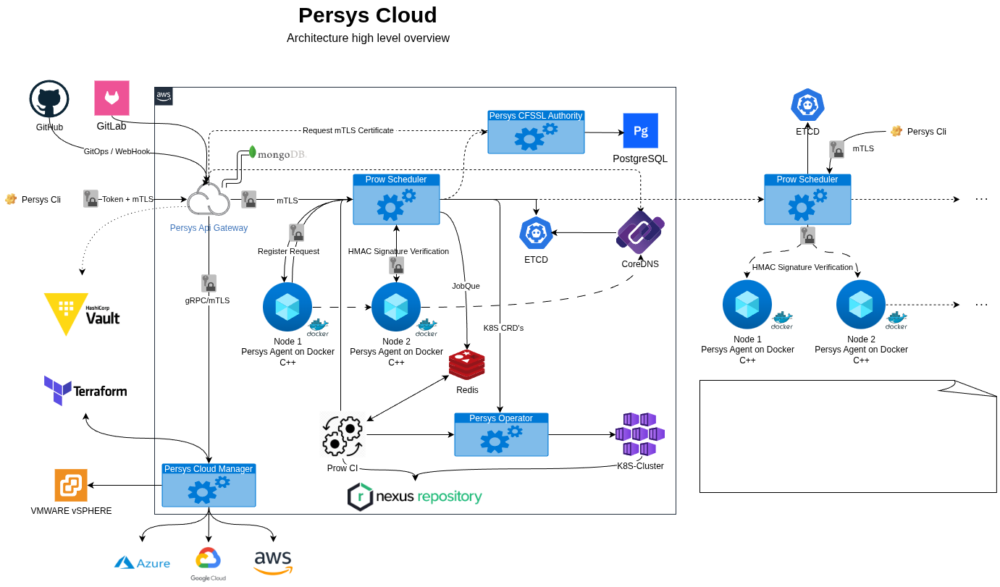

# Persys Cloud

[](LICENSE)
[](go.mod)
[](https://github.com/persys-dev/persys-cloud/actions)

> **Note**: This project is under active development and may have issues and limitations. We welcome contributions and feedback!

## Table of Contents

- [Overview](#overview)
- [Architecture](#architecture)
- [Core Components](#core-components)
- [Quick Start](#quick-start)
- [Local Development](#local-development)
- [Services](#services)
- [Documentation](#documentation)
- [Contributing](#contributing)
- [Community](#community)
- [License](#license)

## Overview

Persys Cloud is an open-source platform that provides **DevOps/SRE as a Service** with automated workload orchestration across both Kubernetes clusters and Docker-based Linux nodes. It simplifies the deployment and management of containerized applications through intelligent scheduling and multi-cloud infrastructure management.

### What is Persys Cloud?

Persys Cloud is a comprehensive platform that offers:

- **Hybrid Workload Orchestration**: Manage workloads across Kubernetes clusters and Docker-based Linux nodes
- **Intelligent Scheduling**: Automated workload placement and resource optimization
- **Multi-cloud Infrastructure Management**: Unified management across AWS, Azure, GCP, and on-premises
- **DevOps/SRE Automation**: Streamlined CI/CD pipelines and operational tasks
- **Secure Agent Communication**: mTLS-based secure communication between components
- **Real-time Monitoring**: Container status monitoring and health checks

## Architecture

### System Design

Persys Cloud uses a distributed architecture with secure agent-based communication:



### Core Architecture Components

1. **API Gateway**: Main entry point for all API requests with authentication and routing
2. **Prow Scheduler**: Intelligent workload scheduler that manages container deployment
3. **Persys Agent**: Lightweight agent deployed on Docker-based Linux nodes for workload execution
4. **Cloud Management**: Multi-cloud infrastructure provisioning and management
5. **Persys CFSSL**: Certificate authority for secure mTLS communication
6. **ETCD**: Distributed key-value store for configuration and state management
7. **CoreDNS**: Service discovery and DNS management

### Request Flow

Here's how requests flow through the system:


> **Have suggestions or found issues?** Please [open an issue](https://github.com/persys-dev/persys-cloud/issues) with your feedback!

## Core Components

### Prow Scheduler
The intelligent workload orchestrator that:
- Manages workload scheduling across nodes
- Handles container lifecycle management
- Provides real-time monitoring and status updates
- Implements secure mTLS communication with agents
- Stores configuration and state in ETCD

### Persys Agent
Lightweight agents deployed on Docker-based Linux nodes that:
- Execute container workloads (Docker containers, Docker Compose, Git-based deployments)
- Report node status and resource utilization
- Handle secure communication with the scheduler
- Manage local container lifecycle
- Support multiple workload types:
  - `docker-container`: Single container deployments
  - `docker-compose`: Multi-container applications
  - `git-compose`: Git repository-based deployments

### Cloud Management
Multi-cloud infrastructure management service that:
- Provisions and manages Kubernetes clusters
- Handles cloud provider integrations (AWS, Azure, GCP)
- Manages infrastructure as code with Terraform
- Provides unified cloud resource management

### API Gateway
Centralized API management that:
- Provides RESTful APIs for all platform operations
- Handles authentication and authorization
- Routes requests to appropriate services
- Manages API versioning and documentation

## Quick Start

### Prerequisites

- Docker and Docker Compose
- Kubernetes CLI (kubectl) - for Kubernetes operations
- Git

### 1. Clone the Repository

```bash
git clone https://github.com/persys-dev/persys-cloud.git
cd persys-cloud
```

### 2. Choose Your Setup Method

#### Option A: Docker Compose (Recommended for Development)

```bash
make up
```

This initializes the complete platform in a local Docker environment using docker-compose.

#### Option B: Kind (Local Kubernetes)

```bash
make kind
```

This builds all Docker images locally, generates Kubernetes deployment files, and deploys to a Kind cluster.

#### Option C: Shell Script

```bash
chmod +x init.sh
./init.sh
```

### 3. Access the Platform

Once deployed, you can interact with Persys Cloud using:

- **REST API**: Direct HTTP requests to the API Gateway
- **CLI Client**: Command-line interface (when available)
- **Postman**: API testing and automation

### 4. Deploy Your First Workload

1. **Register Nodes**: Add Docker-based Linux nodes to the cluster
2. **Create Workload**: Define your container workload specification
3. **Schedule Workload**: Submit workload to the Prow Scheduler
4. **Monitor**: Track deployment status and container health
5. **Scale**: Automatically scale workloads based on demand

## Local Development

### Development Environment Setup

1. **Clone and Setup**:
   ```bash
   git clone https://github.com/persys-dev/persys-cloud.git
   cd persys-cloud
   ```

2. **Start Services**:
   ```bash
   # Using Docker Compose
   make up
   
   # Or using Kind
   make kind
   ```

3. **Access Services**:
   - API Gateway: `http://localhost:8551`
   - Prow Scheduler: `http://localhost:8084`
   - Cloud Management: `http://localhost:9090`
   - ETCD: `http://localhost:2379`
   - CoreDNS: `http://localhost:53`

### Development Workflow

1. Make changes to the codebase
2. Run tests: `make test`
3. Build images: `make build`
4. Deploy changes: `make deploy`
5. Verify functionality

### Agent Development

To develop or test the Persys Agent:

```bash
# Build the agent
cd prow
make build

# Run the agent locally
make run

# Test agent communication
curl -X POST http://localhost:8084/api/v1/nodes/register \
  -H "Content-Type: application/json" \
  -d '{"nodeId":"test-node","ipAddress":"localhost","agentPort":8080}'
```

## Services

Persys Cloud consists of several microservices, each with its own README and documentation:

### Core Services

- **[API Gateway](api-gateway/)**: Main entry point for all API requests with authentication
- **[Prow Scheduler](prow/)**: Intelligent workload orchestration and scheduling
- **[Cloud Management](cloud-mgmt/)**: Multi-cloud infrastructure management
- **[Persys CFSSL](persys-cfssl/)**: Certificate management and PKI for mTLS
- **[Persys Operator](persys-operator/)**: Place Holder
- **[Persys Agent](persys-agent/)**: Place Holder
- **[Persys CLI](persys-cli/)**: Place Holder

### Infrastructure

- **[Infrastructure](infra/)**: Terraform configurations, Kubernetes manifests, and deployment scripts
- **[Documentation](docs/)**: Comprehensive documentation and guides

Each service directory contains detailed README files explaining the component's purpose, architecture, and ownership.

## Documentation

Comprehensive documentation is available in the [docs/](docs/) directory:

- **[Getting Started](docs/getting-started.md)**: Step-by-step guide for new users
- **[How It Works](docs/how-it-works.md)**: Detailed explanation of system components
- **[Installation](docs/install.md)**: Installation and deployment instructions
- **[Architecture](docs/architecture.md)**: System architecture and design decisions
- **[Contributing](docs/contributions.md)**: Guidelines for contributors

## Contributing

We welcome contributions from the community! Here's how you can help:

### Ways to Contribute

- 🐛 **Report Bugs**: Open an issue with detailed bug reports
- 💡 **Feature Requests**: Suggest new features and improvements
- 🔧 **Code Contributions**: Submit pull requests with code changes
- 📚 **Documentation**: Help improve our documentation
- 🧪 **Testing**: Test features and report issues

### Getting Started

1. Fork the repository
2. Create a feature branch: `git checkout -b feature/amazing-feature`
3. Make your changes
4. Add tests for new functionality
5. Commit your changes: `git commit -m 'Add amazing feature'`
6. Push to the branch: `git push origin feature/amazing-feature`
7. Open a Pull Request

### Development Guidelines

- Follow Go coding standards and best practices
- Add tests for new functionality
- Update documentation for any changes
- Ensure all tests pass before submitting PRs
- Use conventional commit messages

## Community

Join our growing community of developers and contributors:

### Communication Channels

- **Slack**: [Join our Slack workspace](https://join.slack.com/t/persys-cicd/shared_invite/zt-1lje1wst0-E0TjKMIXGe1FGLex1uQoxg)
- **GitHub Issues**: [Report bugs and request features](https://github.com/persys-dev/persys-cloud/issues)
- **GitHub Discussions**: [Join discussions](https://github.com/persys-dev/persys-cloud/discussions)

### Community Guidelines

- Be respectful and inclusive
- Help others learn and grow
- Share knowledge and best practices
- Provide constructive feedback
- Follow the [Code of Conduct](CODE_OF_CONDUCT.md)

## License

This project is licensed under the MIT License - see the [LICENSE](LICENSE) file for details.

## Acknowledgments

- Built with love by the Persys Cloud community
- Powered by open-source technologies including Docker, Kubernetes, ETCD, and CoreDNS
- Inspired by the Cloud Native Computing Foundation (CNCF) ecosystem

---

**Persys Cloud** - Simplifying DevOps/SRE with intelligent workload orchestration.

For more information, visit [https://github.com/persys-dev/persys-cloud](https://github.com/persys-dev/persys-cloud)
