# Persys Cloud System Flow Visualization

## System Architecture Overview

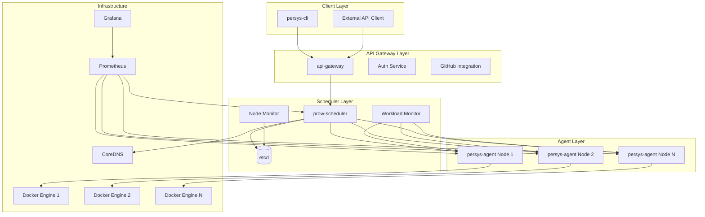

## Complete Workload Lifecycle Flow

### 1. Workload Creation & Scheduling

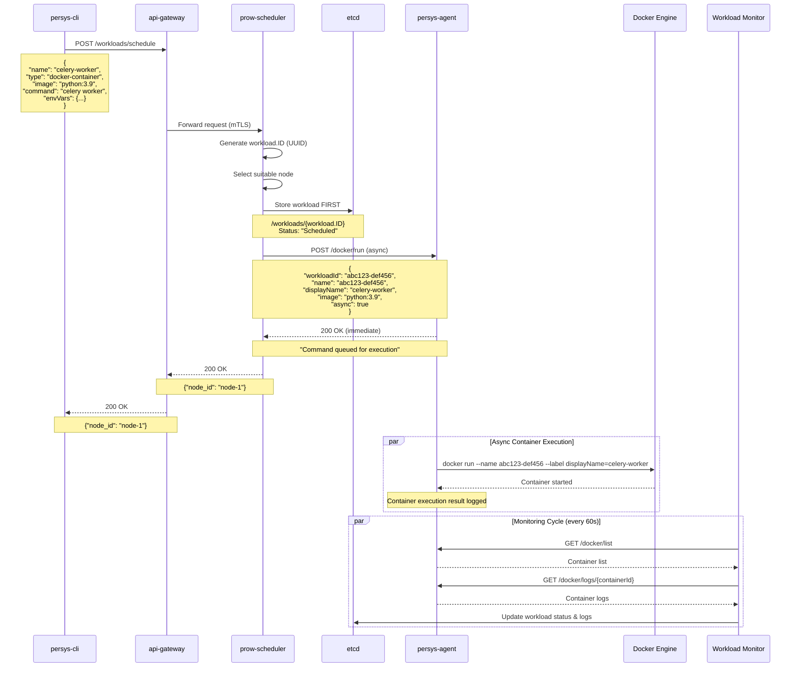

### 2. Node Registration & Health Monitoring

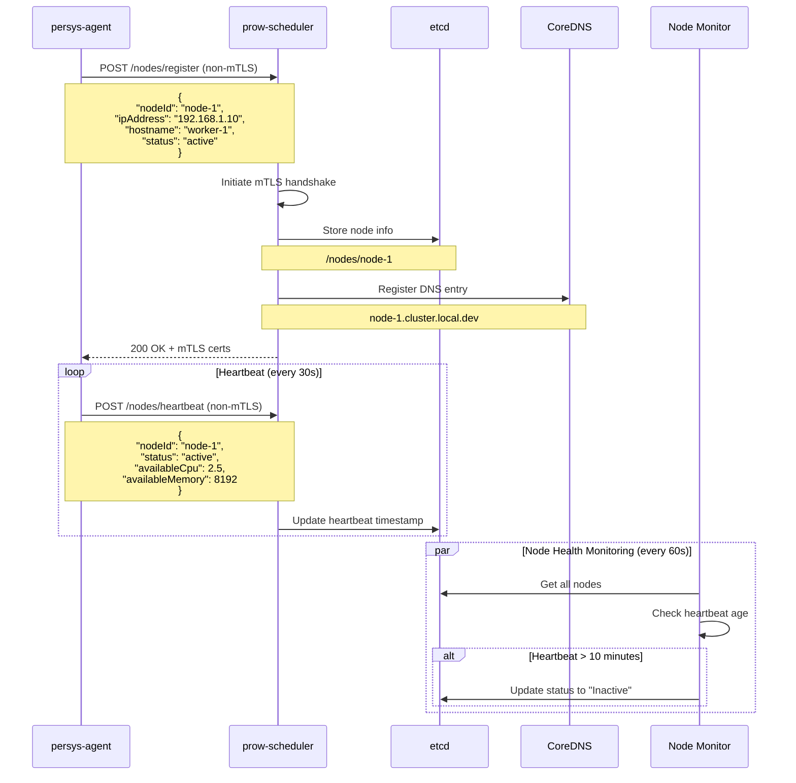

### 3. Workload Status Monitoring & Log Capture

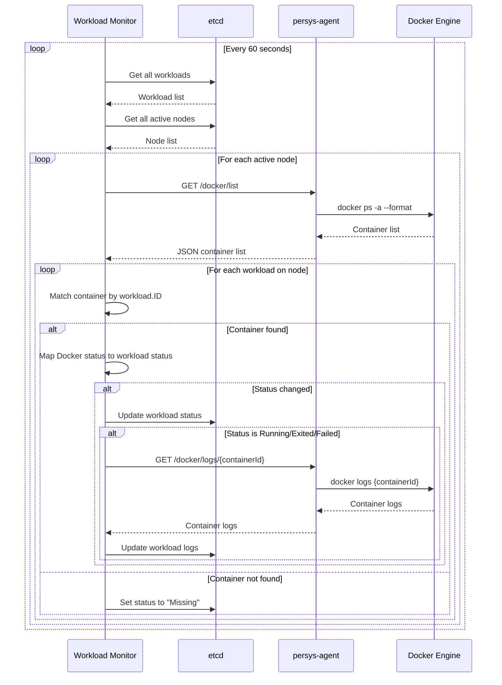

## Data Flow Architecture

### 1. Request Flow (mTLS vs non-mTLS)

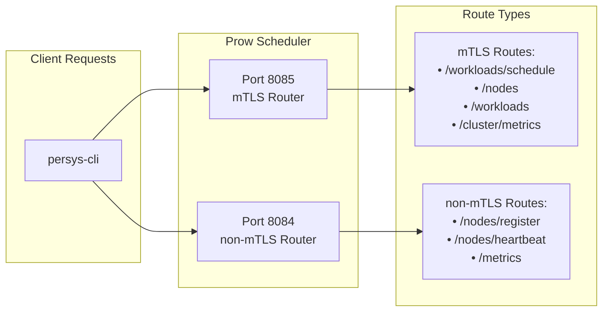

### 2. etcd Data Structure

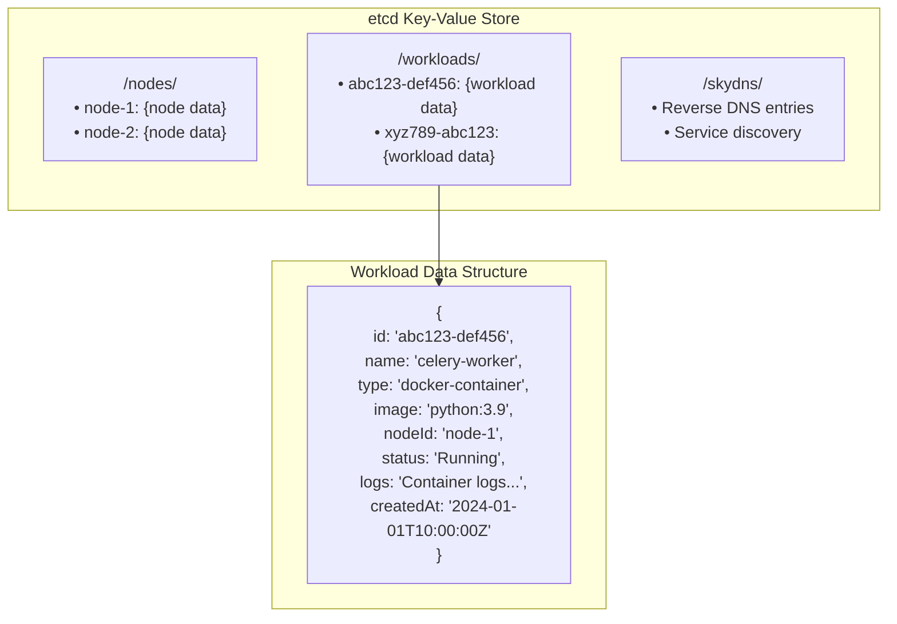

### 3. Container Naming & Labeling Strategy

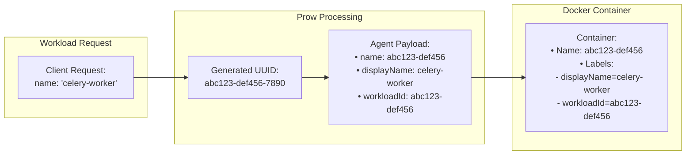

## Monitoring & Observability

### 1. Metrics Collection

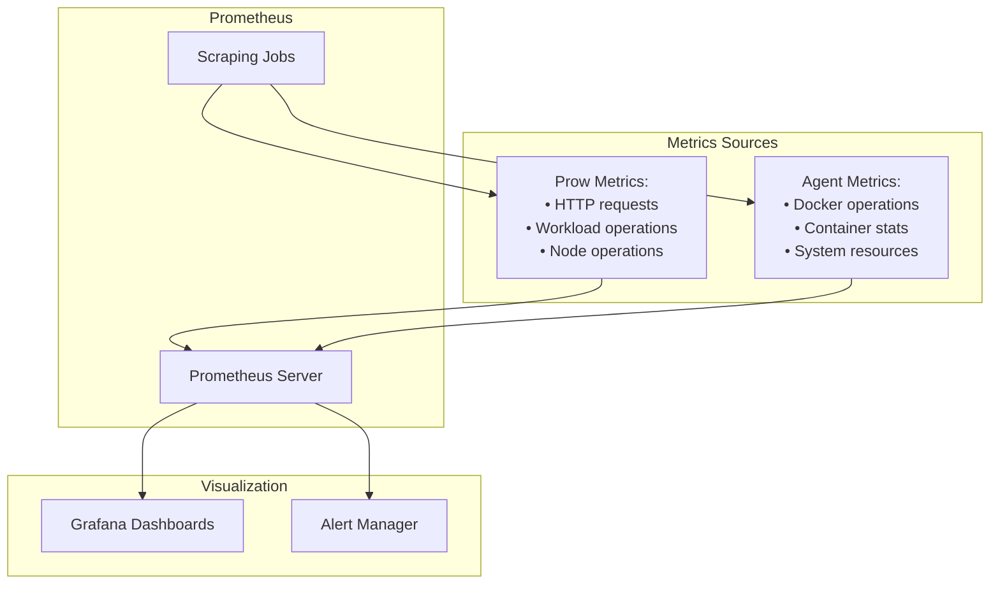

### 2. Log Flow

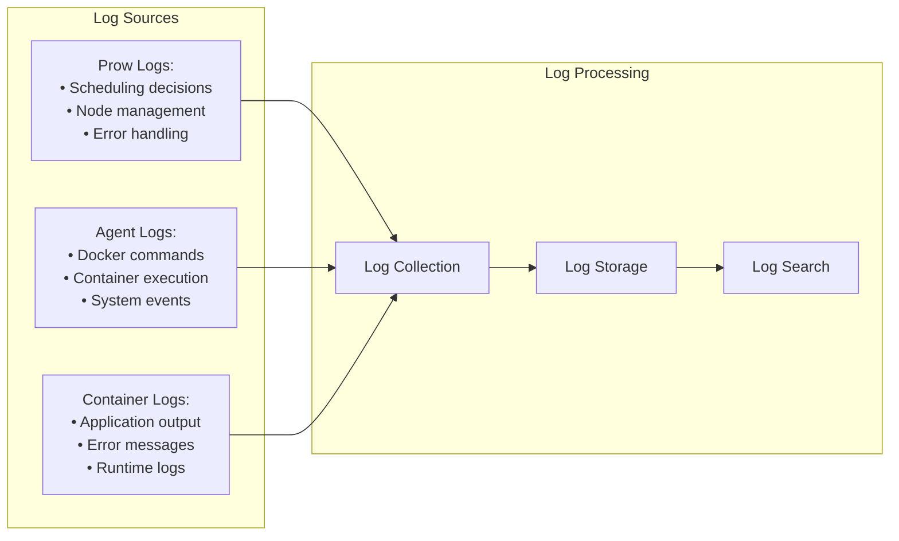

## Error Handling & Recovery

### 1. Failure Scenarios

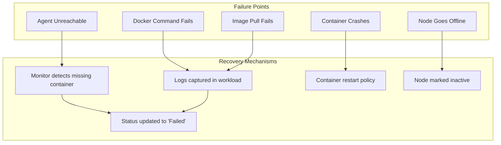

### 2. Timeout Prevention

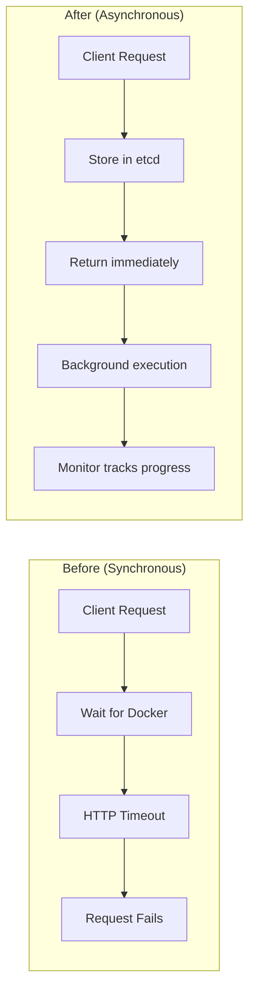

## Security Model

### 1. Authentication & Authorization

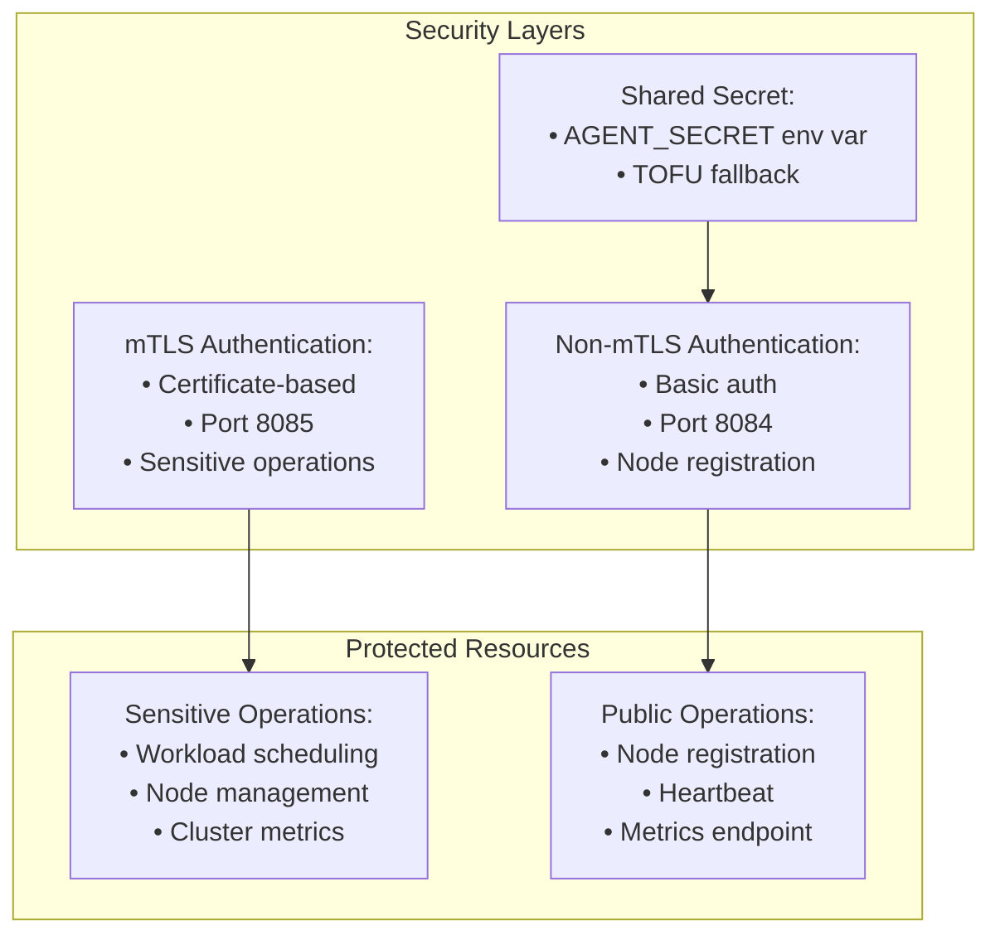

## Key Benefits of This Architecture

1. **Reliability**: Workloads stored in etcd before execution
2. **Scalability**: Asynchronous execution prevents timeouts
3. **Observability**: Comprehensive monitoring and logging
4. **Security**: Multi-layered authentication model
5. **Consistency**: Unique workload IDs throughout the system
6. **Recovery**: Automatic detection and status updates
7. **Performance**: Non-blocking operations with background monitoring

This architecture ensures that the persys-cloud system can handle complex container orchestration while maintaining reliability, security, and observability at scale. 