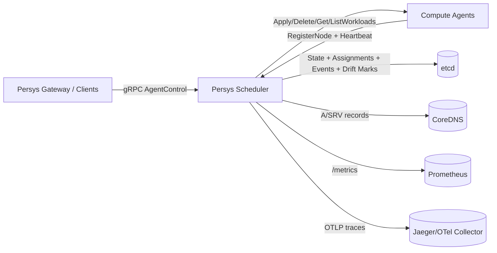

# Persys Scheduler

`persys-scheduler` is the control-plane scheduler for **Persys Compute**.
It accepts node registrations, stores cluster state in etcd, places workloads on eligible agents, and continuously reconciles desired vs actual state.

## What This Service Does

- Exposes a gRPC control API for nodes and workload lifecycle.
- Persists scheduler state in etcd (`/nodes`, `/workloads`, `/assignments`, retries, reconciliation records, events).
- Schedules workloads based on node readiness, resources, labels, and supported workload types.
- Reconciles workloads (`Running` / `Stopped` / `Deleted`) against agent-reported state.
- Publishes Prometheus metrics and OpenTelemetry traces.
- Updates CoreDNS records for scheduler and registered agents for service discovery.

## Architecture



## Operating Modes

The scheduler now runs with explicit operating modes:

- `normal`: etcd healthy and writable; scheduling/reconciliation/writes enabled.
- `degraded`: etcd unreachable or write/read/delete failures; control-plane writes are frozen.
- `recovery`: etcd reachable again but persistent state is empty; scheduler remains frozen pending restore/import.

### Behavior in Degraded/Recovery

- Rejects mutating workload RPCs (`ApplyWorkload`, `DeleteWorkload`, `RetryWorkload`).
- Rejects node registration and instructs heartbeating agents to drain.
- Pauses reconciliation and monitoring loops that require safe writes.
- Keeps serving `/metrics` and `/health`.
- Uses cached last-known nodes/workloads for read APIs when etcd reads fail.

## Drift Detection and Action

A periodic drift loop (`SCHEDULER_DRIFT_DETECT_INTERVAL`, default `30s`) compares scheduler state vs agent `ListWorkloads`.

Detected drift types:

- `orphan_on_agent`: workload exists on agent but not scheduler state.
- `state_mismatch`: scheduler status differs from agent actual state.
- `revision_mismatch`: scheduler revision differs from agent revision.
- `missing_on_agent`: scheduler expects workload, agent does not report it.

For each drift, scheduler:

- emits a `DriftDetected` event,
- writes a drift record under `/drifts/<node>/<workload>/<type>` when writable,
- attempts remediation when writable (`state_mismatch` -> align status, `revision_mismatch` -> re-apply, `missing_on_agent` -> retry/reconcile, `orphan_on_agent` -> operator action).

## DNS and Service Discovery

- Scheduler self-registers in CoreDNS on startup.
- SRV record: `_persys-scheduler.<DOMAIN>`.
- A record fallback: `persys-scheduler.<DOMAIN>`.
- Agents register under shard-aware records: `<nodeID>.<SCHEDULER_SHARD_KEY>.agents.persys.cloud`.
- If CoreDNS is unavailable, scheduler logs a warning and continues running.

## API

Proto: `api/proto/control.proto`  
Service: `persys.control.v1.AgentControl`

Implemented RPCs include:

- `RegisterNode`
- `Heartbeat`
- `ApplyWorkload`
- `DeleteWorkload`
- `RetryWorkload`
- `ListNodes`
- `GetNode`
- `ListWorkloads`
- `GetWorkload`
- `GetClusterSummary`

## Observability

### Prometheus

- Endpoint: `GET /metrics` (default `:8084`)
- Includes:
  - inbound gRPC request total + latency by method/code,
  - outbound scheduler->agent RPC total + latency,
  - reconciliation results and cycle latency,
  - node status gauges,
  - workload status and desired-state gauges.

### Health

- Endpoint: `GET /health`
- Returns JSON with:
  - `status`
  - `mode`
  - `reason`
  - `modeChangedAt`

### OpenTelemetry

- gRPC server is instrumented (`otelgrpc`).
- HTTP `/metrics` and `/health` handlers are instrumented (`otelhttp`).
- Runtime OTel errors are routed through scheduler logging.
- If OTLP endpoint is not configured, exporter is cleanly disabled.

## Default Ports

- gRPC control plane: `:8085`
- Metrics + health HTTP: `:8084`

## Key Environment Variables

See `sample.env` for baseline values.

Core/runtime:

- `ETCD_ENDPOINTS` (default `localhost:2379`)
- `DOMAIN` (default `persys.local`)
- `GRPC_PORT` (default `8085`)
- `METRICS_PORT` (default `8084`)

Mode/reconciliation/drift:

- `SCHEDULER_RECONCILE_INTERVAL` (default `5s`)
- `SCHEDULER_DRIFT_DETECT_INTERVAL` (default `30s`)
- `SCHEDULER_NODE_UNAVAILABLE_GRACE`
- `SCHEDULER_MISSING_GRACE_PERIOD`

DNS/discovery:

- `AGENTS_DISCOVERY_DOMAIN` (default `agents.persys.cloud`)
- `SCHEDULER_SHARD_KEY` (default `default`)
- `SCHEDULER_ADVERTISE_IP` (optional; auto-detected if unset)
- `SCHEDULER_ADVERTISE_PORT` (optional; defaults to `GRPC_PORT`)

Telemetry:

- `OTEL_EXPORTER_OTLP_ENDPOINT` (or `JAEGER_ENDPOINT` fallback)
- `OTEL_EXPORTER_OTLP_INSECURE`

mTLS:

- `PERSYS_TLS_CA` (default `/etc/persys/certs/persys-scheduler/ca.pem`)
- `PERSYS_TLS_CERT` (default `/etc/persys/certs/persys-scheduler/persys_scheduler.crt`)
- `PERSYS_TLS_KEY` (default `/etc/persys/certs/persys-scheduler/persys_scheduler-key.key`)
- `PERSYS_VAULT_ENABLED` (default `false`)
- `PERSYS_VAULT_ADDR` (default `http://127.0.0.1:8200`)
- `PERSYS_VAULT_AUTH_METHOD` (`token` or `approle`)
- `PERSYS_VAULT_TOKEN` (token auth)
- `PERSYS_VAULT_APPROLE_ROLE_ID` / `PERSYS_VAULT_APPROLE_SECRET_ID` (AppRole auth)
- `PERSYS_VAULT_PKI_MOUNT` (default `pki`)
- `PERSYS_VAULT_PKI_ROLE` (default `persys-scheduler`)
- `PERSYS_VAULT_CERT_TTL` (default `24h`)
- `PERSYS_VAULT_RETRY_INTERVAL` (default `1m`)
- `PERSYS_VAULT_SERVICE_NAME` (default `persys-scheduler`)
- `PERSYS_VAULT_SERVICE_DOMAIN` (optional)

## Local Run

```bash
cd persys-scheduler
go run ./cmd/scheduler -insecure
```

`-insecure` disables mTLS for local/dev testing only.

## Build and Test

```bash
cd persys-scheduler
go build ./...
go test ./...
```
