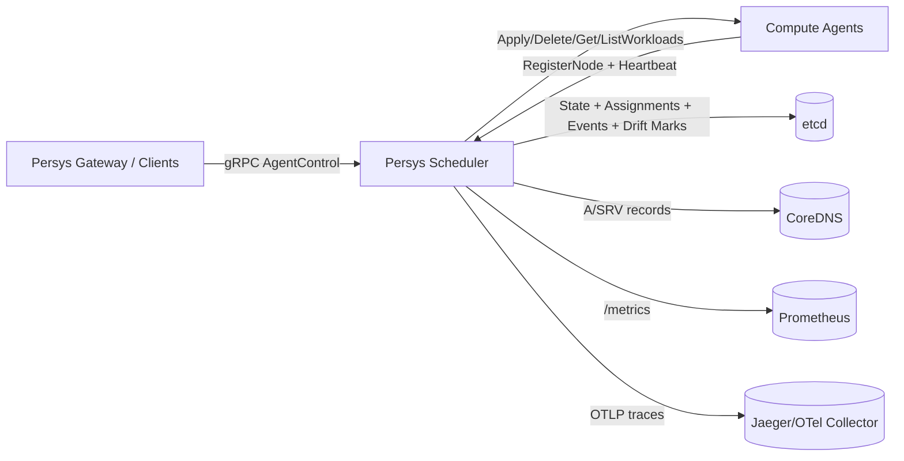

# Persys Scheduler

`persys-scheduler` is the control-plane scheduler for **Persys Compute**.
It accepts node registrations, stores cluster state in etcd, places workloads on eligible agents, and continuously reconciles desired vs actual state.

## What This Service Does

- Exposes a gRPC control API for nodes and workload lifecycle.
- Persists scheduler state in etcd (`/nodes`, `/workloads-spec`, `/workloads-status`, `/volumes`, `/attachments`, assignments, retries, reconciliation records, events).
- Offloads high-churn telemetry data to Redis for automatic cleanup (reconciliation metadata, event logs).
- Schedules workloads based on node readiness, resources, labels, supported workload types, and storage driver capabilities.
- Reconciles workloads (`Running` / `Stopped` / `Deleted`) against agent-reported state with exponential backoff protection.
- Manages workload retry state with failure grace periods to allow transient failures to self-heal.
- Tracks managed volume provisioning, attachment, and retention across workload lifecycle.
- Collects and exposes per-workload utilization telemetry (CPU, memory, disk, network).
- Publishes Prometheus metrics and OpenTelemetry traces.
- Updates CoreDNS records for scheduler and registered agents for service discovery.

## Architecture


```mermaid
flowchart LR
    GW[Persys Gateway / Clients] -->|gRPC AgentControl| SCH[Persys Scheduler]
    AG[Compute Agents] -->|RegisterNode + Heartbeat| SCH
    SCH -->|Apply/Delete/Get/ListWorkloads| AG

    SCH -->|State + Assignments + Events + Drift Marks| ETCD[(etcd)]
    SCH -->|A/SRV records| DNS[(CoreDNS)]

    SCH -->|/metrics| PROM[(Prometheus)]
    SCH -->|OTLP traces| OTLP[(Jaeger/OTel Collector)]
```

## Operating Modes

The scheduler now runs with explicit operating modes:

- `normal`: etcd healthy and writable; scheduling/reconciliation/writes enabled.
- `degraded`: etcd unreachable or write/read/delete failures; control-plane writes are frozen.
- `recovery`: etcd reachable again but persistent state is empty; scheduler remains frozen pending restore/import.

### Behavior in Degraded/Recovery

- Rejects mutating workload RPCs (`ApplyWorkload`, `DeleteWorkload`, `RetryWorkload`).
- Rejects node registration and instructs heartbeating agents to drain.
- Pauses reconciliation and monitoring loops that require safe writes.
- Keeps serving `/metrics` and `/health`.
- Uses cached last-known nodes/workloads for read APIs when etcd reads fail.

## Managed Volumes and Storage

The scheduler supports provisioning and managing workload volumes across different storage backends:

### Supported Drivers

- `local` - Host bind paths (default, always available)
- `nfs` - NFS server mounts
- `ceph-rbd` - Ceph RBD block devices

### Node Storage Capabilities

Nodes advertise supported storage drivers during registration:

- `RegisterNode` includes `SupportedStorageDrivers[]string` field
- Scheduler filters nodes based on workload storage requirements before placement
- Storage capability can also be expressed via node labels with `storage.*` prefix (e.g., `storage.nfs=true`)

### Workload Volume Specifications

Each workload can request managed volumes with:

- Volume name, driver, size (GB), access mode, filesystem type
- Mount path and read-only settings
- Retain policy (`Delete` or `Retain`) - determines cleanup behavior on workload deletion

### Volume Lifecycle

1. **Provision** - Volume is created in the storage backend
2. **Attach** - Volume is attached to the assigned node/workload
3. **Mount** - Runtime mounts the volume at specified path
4. **Detach** - On workload stop/deletion, volume is detached
5. **Cleanup** - Based on retain policy:
   - `Delete` (default) - Volume is deleted
   - `Retain` - Volume persists for manual recovery

State is tracked in etcd under `/volumes` and `/attachments` prefixes with `ManagedVolumeRecord` and `VolumeAttachmentRecord`.

## Redis Telemetry Store

The scheduler uses Redis to store high-churn telemetry data, significantly reducing etcd write load:

### What Gets Stored in Redis

- Reconciliation metadata (per-workload retry attempt tracking, backoff timers)
- Event history (bounded list with TTL and max entries)
- Optionally, high-frequency reconciliation status updates

### Data Retention

- Reconciliation data: TTL 24 hours (configurable via `REDIS_RECONCILE_TTL`)
- Event history: TTL 24 hours (configurable via `REDIS_EVENT_TTL`)
- Maximum event entries: 1000 (configurable via `REDIS_EVENT_MAX_ENTRIES`)

### Graceful Fallback

- If Redis is unavailable, scheduler automatically falls back to etcd for all storage
- Scheduler continues operating normally with etcd-only mode
- No data loss or service interruption

### Storage Benefits

In typical operation (100 workloads, 5s reconciliation interval):
- **Before Redis**: ~172,800 etcd writes in 12 hours (fills 2GB limit)
- **After Redis**: ~1,000 etcd writes in 12 hours (maintains etcd under 100MB)
- **Result**: 99.8% reduction in etcd write volume

A periodic drift loop (`SCHEDULER_DRIFT_DETECT_INTERVAL`, default `30s`) compares scheduler state vs agent `ListWorkloads`.

Detected drift types:

- `orphan_on_agent`: workload exists on agent but not scheduler state.
- `state_mismatch`: scheduler status differs from agent actual state.
- `revision_mismatch`: scheduler revision differs from agent revision.
- `missing_on_agent`: scheduler expects workload, agent does not report it.

For each drift, scheduler:

- emits a `DriftDetected` event,
- writes a drift record under `/drifts/<node>/<workload>/<type>` when writable,
- attempts remediation when writable (`state_mismatch` -> align status, `revision_mismatch` -> re-apply, `missing_on_agent` -> retry/reconcile, `orphan_on_agent` -> operator action).

## Drift Detection and Action

A periodic drift loop (`SCHEDULER_DRIFT_DETECT_INTERVAL`, default `30s`) compares scheduler state vs agent `ListWorkloads`.

When desired state is `Running` but agent-reported state is `Missing`, `Stopped`, or `Failed`, scheduler does not immediately re-apply every cycle.

- Base guard:
  - `max(apply_timeout_for_workload, SCHEDULER_REAPPLY_GUARD)` with a hard minimum of `15s`.
  - Defaults to `45s` for containers/compose and `240s` for VMs (from apply timeout defaults).
- Backoff progression per re-apply attempt:
  - `next_allowed = now + base_guard * 2^(attempt-1)`
  - capped at `15m`.
- Metadata persisted per workload:
  - `reapplyAttempts`
  - `reapplyNextAt`
  - `lastApplyRequestAt`
  - `lastApplyRevision`
- If reconciliation runs before `reapplyNextAt`, action is `ReapplyBackoffWait` and no apply RPC is sent.
- Backoff metadata is reset when scheduler confirms desired state already matches actual state.

### 2) Failure retry backoff (`RetryPending` path)

When reconciliation/apply fails, scheduler updates workload retry state:

- Default retry budget: `MaxAttempts=5`.
- Failure grace window:
  - First observed failure starts a `2m` grace period.
  - During grace, scheduler keeps workload in `RetryPending` and schedules retries using exponential backoff.
- Retry delay formula:
  - `5s, 10s, 20s, 40s, 80s, ...` capped at `2m`.
- If attempts are exhausted after grace, workload is marked `Failed`.
- When `NextRetryAt` is reached, reconciler marks retry due and proceeds with another attempt.

## DNS and Service Discovery

- Scheduler self-registers in CoreDNS on startup.
- SRV record: `_persys-scheduler.<DOMAIN>`.
- A record fallback: `persys-scheduler.<DOMAIN>`.
- Agents register under shard-aware records: `<nodeID>.<SCHEDULER_SHARD_KEY>.agents.persys.cloud`.
- If CoreDNS is unavailable, scheduler logs a warning and continues running.

## API

Proto: `api/proto/control.proto`  
Service: `persys.control.v1.AgentControl`

Implemented RPCs include:

- `RegisterNode`
- `Heartbeat`
- `ApplyWorkload`
- `DeleteWorkload`
- `RetryWorkload`
- `ListNodes`
- `GetNode`
- `ListWorkloads`
- `GetWorkload`
- `GetClusterSummary`

## Observability

### Prometheus

- Endpoint: `GET /metrics` (default `:8084`)
- Includes:
  - inbound gRPC request total + latency by method/code,
  - outbound scheduler->agent RPC total + latency,
  - reconciliation results and cycle latency,
  - node status gauges,
  - workload status and desired-state gauges,
  - workload utilization metrics (CPU %, memory bytes, disk IO, network throughput),
  - state-store writes by category (spec, status, reconciliation, event, assignment, retry).

### Health

- Endpoint: `GET /health`
- Returns JSON with:
  - `status`
  - `mode`
  - `reason`
  - `modeChangedAt`

### OpenTelemetry

- gRPC server is instrumented (`otelgrpc`).
- HTTP `/metrics` and `/health` handlers are instrumented (`otelhttp`).
- Runtime OTel errors are routed through scheduler logging.
- If OTLP endpoint is not configured, exporter is cleanly disabled.

## Default Ports

- gRPC control plane: `:8085`
- Metrics + health HTTP: `:8084`

## Key Environment Variables

See `sample.env` for baseline values.

Core/runtime:

- `ETCD_ENDPOINTS` (default `localhost:2379`)
- `DOMAIN` (default `persys.local`)
- `GRPC_PORT` (default `8085`)
- `METRICS_PORT` (default `8084`)

Mode/reconciliation/drift:

- `SCHEDULER_RECONCILE_INTERVAL` (default `5s`)
- `SCHEDULER_DRIFT_DETECT_INTERVAL` (default `30s`)
- `SCHEDULER_NODE_UNAVAILABLE_GRACE`
- `SCHEDULER_REAPPLY_GUARD` - Base guard for re-apply backoff (default applies timeout, min 15s)
- `SCHEDULER_MISSING_GRACE_PERIOD`

DNS/discovery:

- `AGENTS_DISCOVERY_DOMAIN` (default `agents.persys.cloud`)
- `SCHEDULER_SHARD_KEY` (default `default`)
- `SCHEDULER_ADVERTISE_IP` (optional; auto-detected if unset)
- `SCHEDULER_ADVERTISE_PORT` (optional; defaults to `GRPC_PORT`)

Redis telemetry store (optional but recommended):

- `REDIS_ADDR` - Redis server address (e.g., `localhost:6379`)
- `REDIS_PASSWORD` - Redis authentication password
- `REDIS_DB` - Redis database index (default `0`)
- `REDIS_RECONCILE_TTL` - TTL for reconciliation metadata (default `86400` - 24 hours)
- `REDIS_EVENT_TTL` - TTL for event telemetry (default `86400` - 24 hours)
- `REDIS_EVENT_MAX_ENTRIES` - Maximum event history entries (default `1000`)

Telemetry:

- `OTEL_EXPORTER_OTLP_ENDPOINT` (or `JAEGER_ENDPOINT` fallback)
- `OTEL_EXPORTER_OTLP_INSECURE`

mTLS:

- `PERSYS_TLS_CA` (default `/etc/persys/certs/persys-scheduler/ca.pem`)
- `PERSYS_TLS_CERT` (default `/etc/persys/certs/persys-scheduler/persys_scheduler.crt`)
- `PERSYS_TLS_KEY` (default `/etc/persys/certs/persys-scheduler/persys_scheduler-key.key`)
- `PERSYS_VAULT_ENABLED` (default `false`)
- `PERSYS_VAULT_ADDR` (default `http://127.0.0.1:8200`)
- `PERSYS_VAULT_AUTH_METHOD` (`token` or `approle`)
- `PERSYS_VAULT_TOKEN` (token auth)
- `PERSYS_VAULT_APPROLE_ROLE_ID` / `PERSYS_VAULT_APPROLE_SECRET_ID` (AppRole auth)
- `PERSYS_VAULT_PKI_MOUNT` (default `pki`)
- `PERSYS_VAULT_PKI_ROLE` (default `persys-scheduler`)
- `PERSYS_VAULT_CERT_TTL` (default `24h`)
- `PERSYS_VAULT_RETRY_INTERVAL` (default `1m`)
- `PERSYS_VAULT_SERVICE_NAME` (default `persys-scheduler`)
- `PERSYS_VAULT_SERVICE_DOMAIN` (optional)

## Workload Utilization Telemetry

The scheduler collects and tracks per-workload resource utilization metrics:

### Collected Metrics

- **CPU** - CPU percentage (0-100+)
- **Memory** - Memory bytes used
- **Disk I/O** - Disk read and write bytes
- **Network** - Network RX and TX bytes

### Data Sources

- Containers/Docker Compose - Docker stats API
- VMs - libvirt domain stats (where available)

### Availability in APIs

Workload utilization is included in:

- Workload status objects (latest usage snapshot)
- Agent heartbeats (periodic usage updates)
- Scheduler metrics endpoints (per-workload gauges)
- Control plane APIs (GetWorkload, ListWorkloads)

### Use Cases

- Identify resource-constrained workloads
- Correlate performance issues with scheduling decisions
- Detect anomalous resource consumption
- Inform automation and scaling decisions
- Capacity planning and trend analysis

### Metrics Format

Each workload usage snapshot includes:

```json
{
  "workloadId": "workload-123",
  "type": "container",
  "cpuPercent": 45.2,
  "memoryBytes": 512000000,
  "diskReadBytes": 104857600,
  "diskWriteBytes": 52428800,
  "netRxBytes": 10485760,
  "netTxBytes": 5242880,
  "collectedAt": "2026-05-29T12:30:45Z",
  "source": "docker-stats"
}
```

## Local Run

```bash
cd persys-scheduler
go run ./cmd/scheduler -insecure
```

`-insecure` disables mTLS for local/dev testing only.

## Build and Test

```bash
cd persys-scheduler
go build ./...
go test ./...
```
