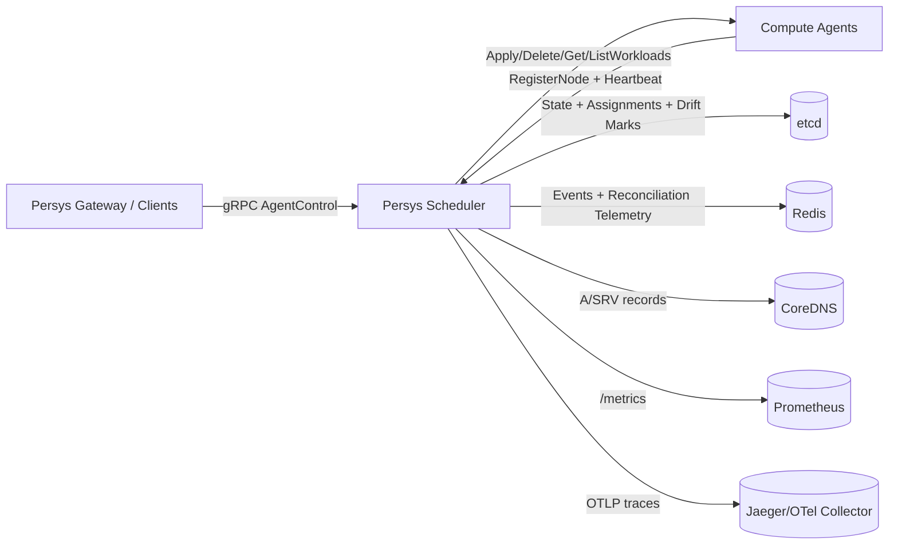

# Persys Scheduler

`persys-scheduler` is the control-plane scheduler for **Persys Compute**.
It accepts node registrations, stores cluster state in etcd, places workloads on eligible agents, and continuously reconciles desired vs actual state.

## What This Service Does

- Exposes a gRPC control API for nodes and workload lifecycle.
- Persists scheduler state in etcd (`/nodes`, `/workloads-spec`, `/workloads-status`, `/volumes`, `/attachments`, assignments, retries, reconciliation records).
- Emits cluster-wide events (node lost, workload scheduled/failed, drift detected, retries, ...) to a Redis Stream — not etcd — for exactly the reasons under "Cluster Events" below.
- Offloads high-churn telemetry data to Redis for automatic cleanup (reconciliation metadata, event history).
- Schedules workloads based on node readiness, resources, labels, supported workload types, and storage driver capabilities.
- Reconciles workloads (`Running` / `Stopped` / `Deleted`) against agent-reported state with exponential backoff protection.
- Manages workload retry state with failure grace periods to allow transient failures to self-heal.
- Tracks managed volume provisioning, attachment, and retention across workload lifecycle.
- Collects and exposes per-workload utilization telemetry (CPU, memory, disk, network).
- Publishes Prometheus metrics and OpenTelemetry traces.
- Updates CoreDNS records for scheduler and registered agents for service discovery.

## Architecture


```mermaid
flowchart LR
    GW[Persys Gateway / Clients] -->|gRPC AgentControl| SCH[Persys Scheduler]
    AG[Compute Agents] -->|RegisterNode + Heartbeat| SCH
    SCH -->|Apply/Delete/Get/ListWorkloads| AG

    SCH -->|State + Assignments + Drift Marks| ETCD[(etcd)]
    SCH -->|Events + Reconciliation Telemetry| REDIS[(Redis)]
    SCH -->|A/SRV records| DNS[(CoreDNS)]

    SCH -->|/metrics| PROM[(Prometheus)]
    SCH -->|OTLP traces| OTLP[(Jaeger/OTel Collector)]
```

## High Availability and Sharding

Multiple scheduler replicas can run against the same etcd cluster. `SCHEDULER_HA_MODE` controls how they coordinate:

- **`failover`** (default): all replicas contend for a single etcd-lease-based election. Exactly one is ever active — driving reconciliation, node/workload monitoring, drift detection, and the placement node-cache watch. The others are hot standbys; if the active replica dies or its lease expires (crash, GC pause past the lease TTL, network partition), another takes over automatically, typically within one lease TTL (15s by default).
- **`active-active`**: nodes are partitioned across `SCHEDULER_SHARD_COUNT` shards by a stable hash of node ID. Each replica is assigned a `SCHEDULER_SHARD_INDEX` and only drives convergence for the nodes that hash into it — so multiple shards make progress concurrently instead of one replica doing all the work. Run more than one replica per shard index to get failover *within* a shard.

In both modes, the gRPC API (`RegisterNode`, `Heartbeat`, `ApplyWorkload`, `DeleteWorkload`, ...) runs unconditionally on **every** replica — those write paths are protected by etcd compare-and-swap, so it's safe for an external load balancer or Swarm's ingress mesh to route agent traffic to any replica regardless of which one currently holds an election. Only the background convergence loops are gated.

**Known limitation of `active-active` mode**: there's no explicit hand-off protocol between shards. If a node fails and its workloads are reassigned (`RelocateWorkloadsFromNode`) to a node owned by a different shard, that shard picks up ownership on its next cycle automatically — but there's a brief window (expected to self-heal within one reconcile interval) where neither shard is actively driving that specific workload. This is a scheduling-latency gap, not a correctness bug, but worth knowing before relying on `active-active` mode for latency-sensitive failover.

Deploying more than one replica without Docker Swarm requires a TCP-passthrough load balancer in front (see `docker-compose.scheduler-ha.snippet.yml` / `haproxy.cfg` in the repo) — plain `docker compose up` can't have multiple containers of the same service all bind the same host port. This isn't needed under `docker stack deploy`, where Swarm's own ingress routing mesh already handles it.

## Object storage (Ceph RGW)

Object buckets are **not** stored in etcd. The scheduler proxies **Ceph RGW** (S3 API):

| Operation | Backend |
|-----------|---------|
| List / create / delete bucket | RGW |
| List objects | RGW |
| User access key / secret | **Vault KV** (path `secret/data/persys/rgw/buckets/{name}` by default) |

- Control-plane RGW credentials: `PERSYS_RGW_ENDPOINT`, `PERSYS_RGW_ACCESS_KEY`, `PERSYS_RGW_SECRET_KEY`
- Vault auth: **vault-manager** `GetServiceCredentials(PERSYS_VAULT_SERVICE_NAME)` → AppRole login (same pattern as certmanager). Optional `PERSYS_VAULT_TOKEN` for break-glass only.
- Optional `PERSYS_RGW_ADMIN_PATH` (default `admin`) registers generated keys via RGW Admin Ops so S3 clients can authenticate.
- gRPC: `CreateBucket`, `ListBuckets`, `GetBucket`, `DeleteBucket`, `GetBucketAccess`, `ListBucketObjects`
- REST (via gateway): `/buckets`, `/buckets/:id`, `/buckets/:id/access`, `/buckets/:id/objects`
- **Agents are not involved** in object storage.

Standalone **block disks** remain a separate control-plane surface (`/disks`, hard pinning for local attach).

## Placement

`selectNodeForWorkload` filters candidate nodes for feasibility (status, taints, workload-type capability, storage driver, CPU/memory availability), then scores the survivors and picks the highest score. The score blends:

- CPU and memory headroom, adjusted for resources already committed to workloads assigned earlier in the same scheduling window but not yet reflected in that node's own heartbeat-reported availability (see "in-flight reservations" below).
- A spread term based on how many workloads are already on the node relative to the busiest candidate, so nodes with similar CPU/memory ratios aren't treated as identical if one is already hosting far more workloads.
- A small deterministic tie-breaker (hashed from workload + node ID) so exact ties — common in a homogeneous fleet — don't always resolve to the same node.

**In-flight reservations**: a node's `AvailableCPU`/`AvailableMemory` only update via that node's own heartbeat, which lags behind a placement decision. The scheduler tracks recently-assigned-but-not-yet-heartbeat-confirmed commitments in memory and subtracts them from a node's effective headroom during scoring (self-expiring after 90s), so concurrent placement decisions — routine now that reconciliation runs with bounded concurrency and `active-active` mode can have multiple replicas placing workloads simultaneously — don't all pick the same "least loaded" node and oversubscribe it before any of their heartbeats catch up.

## Operating Modes

The scheduler now runs with explicit operating modes:

- `normal`: etcd healthy and writable; scheduling/reconciliation/writes enabled.
- `degraded`: etcd unreachable or write/read/delete failures; control-plane writes are frozen.
- `recovery`: etcd reachable again but persistent state is empty; scheduler remains frozen pending restore/import.

### Behavior in Degraded/Recovery

- Rejects mutating workload RPCs (`ApplyWorkload`, `DeleteWorkload`, `RetryWorkload`).
- Rejects node registration and instructs heartbeating agents to drain.
- Pauses reconciliation and monitoring loops that require safe writes.
- Keeps serving `/metrics` and `/health`.
- Uses cached last-known nodes/workloads for read APIs when etcd reads fail.

## Managed Volumes and Storage

The scheduler supports provisioning and managing workload volumes across different storage backends:

### Supported Drivers

- `local` - Host bind paths (default, always available)
- `nfs` - NFS server mounts
- `ceph-rbd` - Ceph RBD block devices

### Node Storage Capabilities

Nodes advertise supported storage drivers during registration:

- `RegisterNode` includes `SupportedStorageDrivers[]string` field
- Scheduler filters nodes based on workload storage requirements before placement
- Storage capability can also be expressed via node labels with `storage.*` prefix (e.g., `storage.nfs=true`)

### Workload Volume Specifications

Each workload can request managed volumes with:

- Volume name, driver, size (GB), access mode, filesystem type
- Mount path and read-only settings
- Retain policy (`Delete` or `Retain`) - determines cleanup behavior on workload deletion

### Volume Lifecycle

1. **Provision** - Volume is created in the storage backend
2. **Attach** - Volume is attached to the assigned node/workload
3. **Mount** - Runtime mounts the volume at specified path
4. **Detach** - On workload stop/deletion, volume is detached
5. **Cleanup** - Based on retain policy:
   - `Delete` (default) - Volume is deleted
   - `Retain` - Volume persists for manual recovery

State is tracked in etcd under `/volumes` and `/attachments` prefixes with `ManagedVolumeRecord` and `VolumeAttachmentRecord`.

## Redis Telemetry Store

The scheduler uses Redis to store high-churn telemetry data, significantly reducing etcd write load:

### What Gets Stored in Redis

- Reconciliation metadata (per-workload retry attempt tracking, backoff timers)
- Cluster-wide event history (Redis Stream — see "Cluster Events" below)
- Optionally, high-frequency reconciliation status updates

### Data Retention

- Reconciliation data: TTL 24 hours (configurable via `REDIS_RECONCILE_TTL`)
- Event history: TTL 24 hours, refreshed on every write (configurable via `REDIS_EVENT_TTL`); capped at 1000 entries via approximate stream trimming (configurable via `REDIS_EVENT_MAX_ENTRIES`)

### Graceful Fallback

- Reconciliation metadata falls back to etcd if Redis is unavailable.
- Cluster events do **not** fall back to etcd — see "Cluster Events" below for why. If Redis is unavailable, events are dropped (logged) rather than persisted elsewhere, and `ListEvents`/`WatchEvents` callers see an empty result rather than an error.

## Cluster Events

`emitEvent` records cluster-wide, human-readable events — `NodeJoined`, `NodeLost`, `NodeLeft`, `WorkloadScheduled`, `WorkloadFailed`, `DriftDetected`, `RetryTriggered`, `Rescheduled`, `Relocated` — for consumption by `persysctl` and dashboard UIs via the `ListEvents` (recent history) and `WatchEvents` (live tail, replays recent history first) gRPC RPCs, both supporting optional filtering by `type`/`workload_id`/`node_id`.

Events live **only in Redis** (a single shared Stream, `scheduler:events`), not etcd. All scheduler replicas share the same Redis instance, so this is cluster-wide in exactly the same sense etcd-backed state is — an event emitted by whichever replica handled the triggering request is visible to every replica's `WatchEvents` callers.

This is a deliberate choice, not an oversight: events are high-churn and purely observability-oriented, so they shouldn't compete for etcd's write throughput with heartbeats and CAS-retried reconciliation — especially since event volume tends to spike at exactly the moments (node flapping, mass retries during an incident) when etcd is already under the most load from everything else. Redis Streams also give bounded retention for free (`MAXLEN ~` trimming applied at write time) instead of needing a separate scan-and-delete sweep, which the previous etcd-backed version required since event IDs are random UUIDs with no cheap time-range key trick available.
- No data loss or service interruption

### Storage Benefits

In typical operation (100 workloads, 5s reconciliation interval):
- **Before Redis**: ~172,800 etcd writes in 12 hours (fills 2GB limit)
- **After Redis**: ~1,000 etcd writes in 12 hours (maintains etcd under 100MB)
- **Result**: 99.8% reduction in etcd write volume

A periodic drift loop (`SCHEDULER_DRIFT_DETECT_INTERVAL`, default `30s`) compares scheduler state vs agent `ListWorkloads`.

Detected drift types:

- `orphan_on_agent`: workload exists on agent but not scheduler state.
- `state_mismatch`: scheduler status differs from agent actual state.
- `revision_mismatch`: scheduler revision differs from agent revision.
- `missing_on_agent`: scheduler expects workload, agent does not report it.

For each drift, scheduler:

- emits a `DriftDetected` event,
- writes a drift record under `/drifts/<node>/<workload>/<type>` when writable,
- attempts remediation when writable (`state_mismatch` -> align status, `revision_mismatch` -> re-apply, `missing_on_agent` -> retry/reconcile, `orphan_on_agent` -> operator action).

## Drift Detection and Action

A periodic drift loop (`SCHEDULER_DRIFT_DETECT_INTERVAL`, default `30s`) compares scheduler state vs agent `ListWorkloads`.

When desired state is `Running` but agent-reported state is `Missing`, `Stopped`, or `Failed`, scheduler does not immediately re-apply every cycle.

- Base guard:
  - `max(apply_timeout_for_workload, SCHEDULER_REAPPLY_GUARD)` with a hard minimum of `15s`.
  - Defaults to `45s` for containers/compose and `240s` for VMs (from apply timeout defaults).
- Backoff progression per re-apply attempt:
  - `next_allowed = now + base_guard * 2^(attempt-1)`
  - capped at `15m`.
- Metadata persisted per workload:
  - `reapplyAttempts`
  - `reapplyNextAt`
  - `lastApplyRequestAt`
  - `lastApplyRevision`
- If reconciliation runs before `reapplyNextAt`, action is `ReapplyBackoffWait` and no apply RPC is sent.
- Backoff metadata is reset when scheduler confirms desired state already matches actual state.

### 2) Failure retry backoff (`RetryPending` path)

When reconciliation/apply fails, scheduler updates workload retry state:

- Default retry budget: `MaxAttempts=5`.
- Failure grace window:
  - First observed failure starts a `2m` grace period.
  - During grace, scheduler keeps workload in `RetryPending` and schedules retries using exponential backoff.
- Retry delay formula:
  - `5s, 10s, 20s, 40s, 80s, ...` capped at `2m`.
- If attempts are exhausted after grace, workload is marked `Failed`.
- When `NextRetryAt` is reached, reconciler marks retry due and proceeds with another attempt.

## DNS and Service Discovery

- Scheduler self-registers in CoreDNS on startup, for discovery **by persys-gateway** — agents do not use CoreDNS to reach the scheduler (they connect via the address/LB they were configured with).
- SRV record: `_persys-scheduler.<DOMAIN>`.
- A record fallback: `persys-scheduler.<DOMAIN>`.
- Each replica registers under its own instance-keyed child rather than one shared key, so running multiple replicas produces one record per running replica instead of the last one to start silently overwriting the others. Deregisters its own record on clean shutdown.
- Agents register under shard-aware records: `<nodeID>.<SCHEDULER_SHARD_KEY>.agents.persys.cloud`. (Note: `SCHEDULER_SHARD_KEY` here is a DNS namespace prefix for multi-environment segregation — unrelated to the reconciliation sharding described under High Availability below, despite the similar name.)
- If CoreDNS is unavailable, scheduler logs a warning and continues running.

## API

Proto: `api/proto/control.proto`  
Service: `persys.control.v1.AgentControl`

Implemented RPCs include:

- `RegisterNode`
- `Heartbeat`
- `ApplyWorkload`
- `DeleteWorkload`
- `RetryWorkload`
- `ListNodes`
- `GetNode`
- `ListWorkloads`
- `GetWorkload`
- `GetClusterSummary`

## Observability

### Prometheus

- Endpoint: `GET /metrics` (default `:8084`)
- Includes:
  - inbound gRPC request total + latency by method/code,
  - outbound scheduler->agent RPC total + latency,
  - reconciliation results and cycle latency,
  - node status gauges,
  - workload status and desired-state gauges,
  - workload utilization metrics (CPU %, memory bytes, disk IO, network throughput),
  - state-store writes by category (spec, status, reconciliation, event, assignment, retry).

### Health

- Endpoint: `GET /health`
- Returns JSON with:
  - `status`
  - `mode`
  - `reason`
  - `modeChangedAt`

### OpenTelemetry

- gRPC server is instrumented (`otelgrpc`).
- HTTP `/metrics` and `/health` handlers are instrumented (`otelhttp`).
- Runtime OTel errors are routed through scheduler logging.
- If OTLP endpoint is not configured, exporter is cleanly disabled.

## Default Ports

- gRPC control plane: `:8085`
- Metrics + health HTTP: `:8084`

## Key Environment Variables

See `sample.env` for baseline values.

Core/runtime:

- `ETCD_ENDPOINTS` (default `localhost:2379`)
- `DOMAIN` (default `persys.local`)
- `GRPC_PORT` (default `8085`)
- `METRICS_PORT` (default `8084`)

Mode/reconciliation/drift:

- `SCHEDULER_RECONCILE_INTERVAL` (default `5s`)
- `SCHEDULER_DRIFT_DETECT_INTERVAL` (default `30s`)
- `SCHEDULER_NODE_UNAVAILABLE_GRACE`
- `SCHEDULER_REAPPLY_GUARD` - Base guard for re-apply backoff (default applies timeout, min 15s)
- `SCHEDULER_MISSING_GRACE_PERIOD`

DNS/discovery:

- `AGENTS_DISCOVERY_DOMAIN` (default `agents.persys.cloud`)
- `SCHEDULER_SHARD_KEY` (default `default`)
- `SCHEDULER_ADVERTISE_IP` (optional; auto-detected if unset)
- `SCHEDULER_ADVERTISE_PORT` (optional; defaults to `GRPC_PORT`)

Redis telemetry store (optional but recommended):

- `REDIS_ADDR` - Redis server address (e.g., `localhost:6379`)
- `REDIS_PASSWORD` - Redis authentication password
- `REDIS_DB` - Redis database index (default `0`)
- `REDIS_RECONCILE_TTL` - TTL for reconciliation metadata (default `86400` - 24 hours)
- `REDIS_EVENT_TTL` - TTL for event telemetry (default `86400` - 24 hours)
- `REDIS_EVENT_MAX_ENTRIES` - Maximum event history entries (default `1000`)

Telemetry:

- `OTEL_EXPORTER_OTLP_ENDPOINT` (or `JAEGER_ENDPOINT` fallback)
- `OTEL_EXPORTER_OTLP_INSECURE`

mTLS:

- `PERSYS_TLS_CA` (default `/etc/persys/certs/persys-scheduler/ca.pem`)
- `PERSYS_TLS_CERT` (default `/etc/persys/certs/persys-scheduler/persys_scheduler.crt`)
- `PERSYS_TLS_KEY` (default `/etc/persys/certs/persys-scheduler/persys_scheduler-key.key`)
- `PERSYS_VAULT_ENABLED` (default `false`)
- `PERSYS_VAULT_ADDR` (default `http://127.0.0.1:8200`)
- `PERSYS_VAULT_AUTH_METHOD` (`token` or `approle`)
- `PERSYS_VAULT_TOKEN` (token auth)
- `PERSYS_VAULT_MANAGER_ADDR` (default `vault-manager:50069`) — AppRole via vault-manager
- `PERSYS_VAULT_APPROLE_ROLE_ID` / `PERSYS_VAULT_APPROLE_SECRET_ID` (optional legacy; prefer vault-manager)
- `PERSYS_VAULT_PKI_MOUNT` (default `pki`)
- `PERSYS_VAULT_PKI_ROLE` (default `persys-scheduler`)
- `PERSYS_VAULT_CERT_TTL` (default `24h`)
- `PERSYS_VAULT_RETRY_INTERVAL` (default `1m`)
- `PERSYS_VAULT_SERVICE_NAME` (default `persys-scheduler`)
- `PERSYS_VAULT_SERVICE_DOMAIN` (optional)
- Object storage: `PERSYS_RGW_*` and Vault KV paths — see **Object storage (Ceph RGW)** above

## Workload Utilization Telemetry

The scheduler collects and tracks per-workload resource utilization metrics:

### Collected Metrics

- **CPU** - CPU percentage (0-100+)
- **Memory** - Memory bytes used
- **Disk I/O** - Disk read and write bytes
- **Network** - Network RX and TX bytes

### Data Sources

- Containers/Docker Compose - Docker stats API
- VMs - libvirt domain stats (where available)

### Availability in APIs

Workload utilization is included in:

- Workload status objects (latest usage snapshot)
- Agent heartbeats (periodic usage updates)
- Scheduler metrics endpoints (per-workload gauges)
- Control plane APIs (GetWorkload, ListWorkloads)

### Use Cases

- Identify resource-constrained workloads
- Correlate performance issues with scheduling decisions
- Detect anomalous resource consumption
- Inform automation and scaling decisions
- Capacity planning and trend analysis

### Metrics Format

Each workload usage snapshot includes:

```json
{
  "workloadId": "workload-123",
  "type": "container",
  "cpuPercent": 45.2,
  "memoryBytes": 512000000,
  "diskReadBytes": 104857600,
  "diskWriteBytes": 52428800,
  "netRxBytes": 10485760,
  "netTxBytes": 5242880,
  "collectedAt": "2026-05-29T12:30:45Z",
  "source": "docker-stats"
}
```

## Local Run

```bash
cd persys-scheduler
go run ./cmd/scheduler -insecure
```

`-insecure` disables mTLS for local/dev testing only.

## Build and Test

```bash
cd persys-scheduler
go build ./...
go test ./...
```
