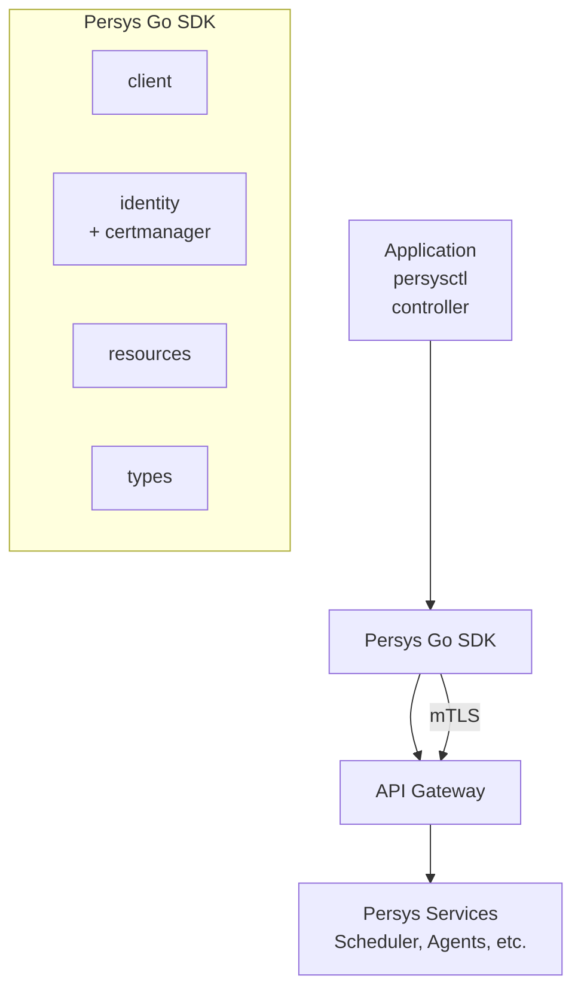

# Persys Go SDK Design Document

## Overview

The Persys Go SDK is the official Go client library for interacting with the Persys Cloud control plane.

It provides a reusable interface for Persys-aware applications and tools by abstracting:

* API communication
* authentication
* identity management (via `pkg/certmanager`)
* mTLS transport
* resource serialization
* control-plane operations

The SDK is intentionally lightweight.

It does not implement orchestration, reconciliation, GitOps, or workload lifecycle management. Those responsibilities belong to higher-level Persys components (`persysctl`, controllers, etc.).

---

## Goals

### Provide a Stable Control Plane Client

Applications should communicate with Persys through a stable SDK interface rather than directly interacting with internal services.

The SDK hides internal topology (scheduler, compute agents, etc.). The public boundary is the **Persys API Gateway**.

---

## Secure by Default

All communication uses HTTPS with mutual TLS.

Certificate lifecycle is handled automatically by `pkg/certmanager` + Vault Manager (no raw certificate paths exposed to users).

```mermaid
Application
     |
     v
Persys SDK
     |
     | mTLS (auto-rotated)
     |
API Gateway
     |
     v
Persys Control Plane
```

---

## Non Goals

The SDK does not provide:

* Git repository watchers
* reconciliation loops
* deployment automation
* scheduling logic
* cluster management daemons

Those belong in `persysctl`, operators, and platform services.

---

## Architecture



---

## Package Layout (Current)

```bash
sdk/
├── client/          # HTTP Gateway client
├── identity/        # Vault + certmanager integration
├── options/         # Configuration
├── resources/       # Fluent builders (Workloads, Nodes, Clusters)
├── types/           # High-level resource models
├── workloads/       # Builder implementation
└── sdk.go           # Main entrypoint
```

---

## Client Package

Main interface for API communication.

```go
client, err := sdk.New(
    sdk.WithEndpoint("https://api.persys.local"),
)
defer client.Close()
```

---

## Options

```go
cfg := options.DefaultOptions()
cfg.VaultManagerAddr = "vault-manager:50069"
cfg.Identity.ServiceName = "my-service"

client, err := sdk.New(func(o *options.Options) error {
    *o = *cfg
    return nil
})
```

**Key options**:
* `WithEndpoint()`
* `WithInsecure()` (dev only)
* Full control over Vault / VaultManager settings

---

## Identity & Certificate Management

Uses `pkg/certmanager.Manager` + Vault Manager service.

* Automatic AppRole credential fetch/rotation
* Certificate issuance and renewal
* No manual cert file management required

---

## Resource Operations

```go
// Workloads
status, err := client.Workloads().Create(ctx, types.Workload{
    Name:  "web",
    Image: "nginx:latest",
})

// Nodes & Clusters
nodes, err := client.Nodes()...     // TODO when implemented
```

---

## Usage Example

See `example/main.go` for full patterns.

---

## Lifecycle

Always close the client:

```go
defer client.Close()
```

This stops certificate rotation goroutines and closes connections.

---

**Design Philosophy**: Small, stable, secure client library focused on connecting applications to the Persys control plane.
